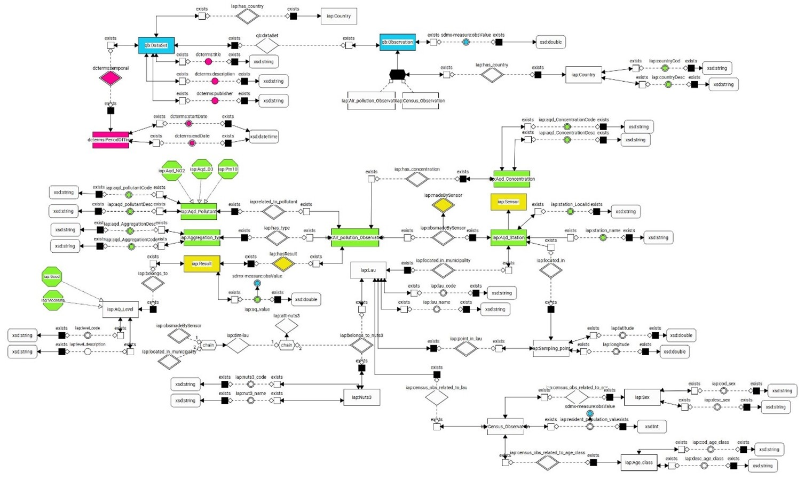
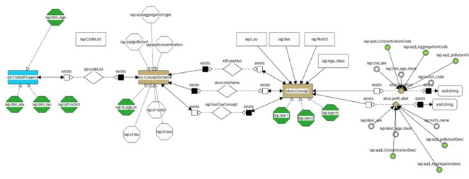
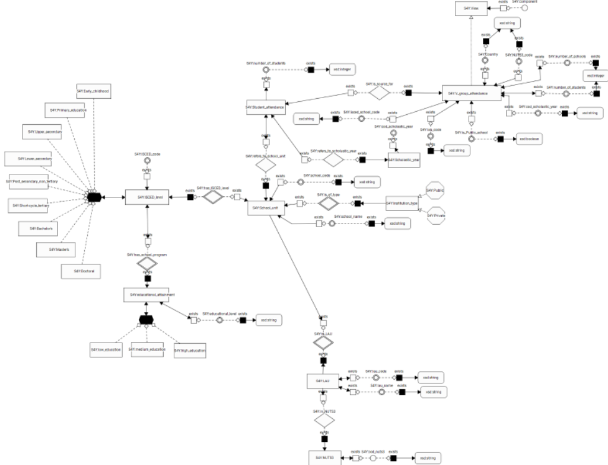
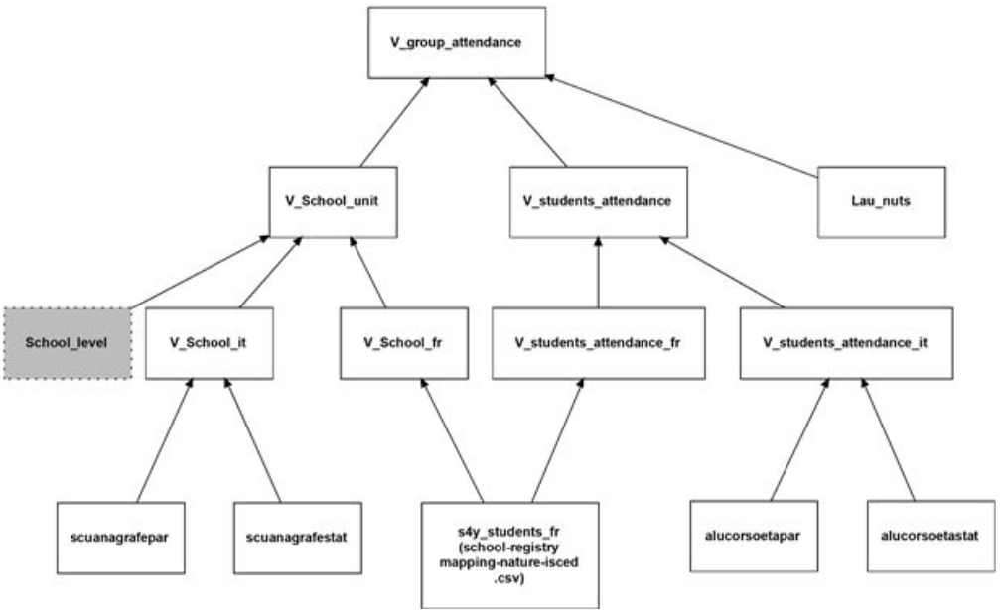
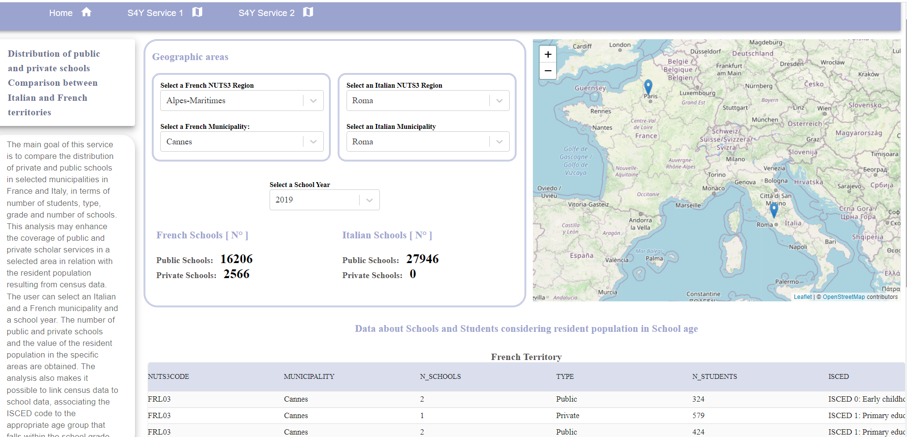
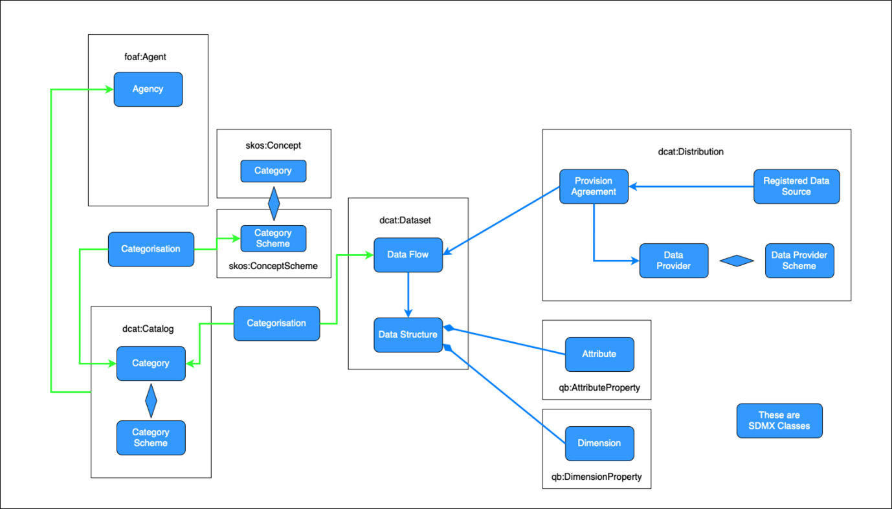
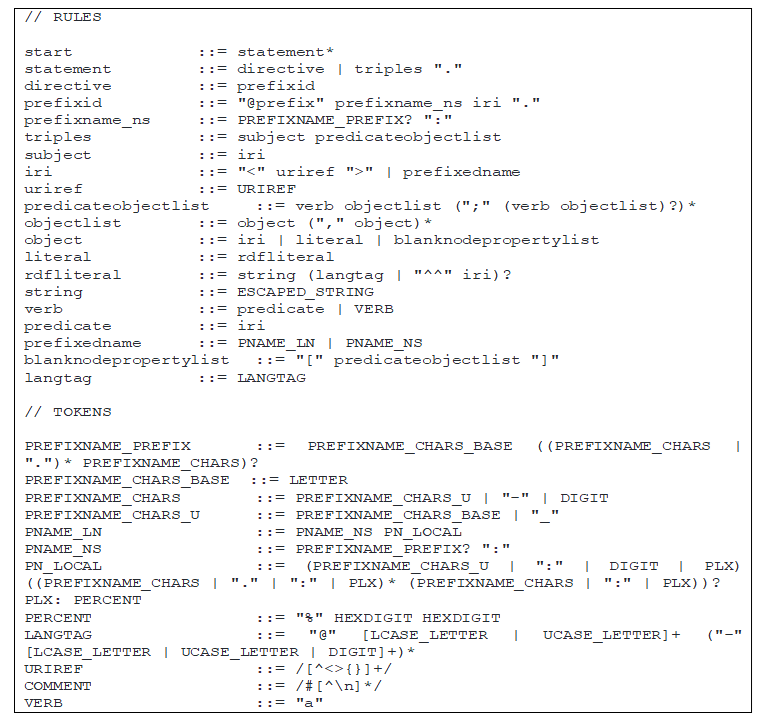

# Deliverable Milestone 6: Report on pilots’ development and deployment

## Introduction

### Scope and objectives of the document

This document describes the Interstat pilot services, how they were built and how they can be used. It is part of the Milestone 6 (M6) of the project, which consists in having the "pilot services deployed and working in real environments", and in particular in the availability of the pilot services applications. M6 pertains to Activity 3 of the project ("Pilot services execution and assessment"), which extends until the end of the project with additional milestones dedicated to the monitoring and assessment of the pilots. Therefore, the services and applications will continue to evolve by continuous improvement in the future. It was thus decided to keep this accompanying document relatively short and high-level and to reference where appropriate to the [online resources](https://github.com/INTERSTAT/), much more detailed and which will be kept up to date as the project cotinues to evolve.

The document starts with a short recap about the different pilots and the technical production environment set up for Interstat. General considerations on the development of pilots are then exposed, with a particular focus on the approaches followed for creating the data pipelines and on the technical stack used for the client applications. More detail is then provided for each of the three pilots, including a reminder of the business case, the description of the relevant models and of the data, metadata, pipeline process and client application. A summary of the lessons learned, the remaining problems and the next steps is given in conclusion.

### One-liners on the pilots

- Support for Environmental Policies (SEP): One of the main goals of this use case is to enrich air quality data with demographic analysis, to support local public authorities responsible for environmental policies.
- Geolocalized facilities (GF): dissemination of information about facilities and integration with related sources
- School for You (S4Y): This pilot allows users such as citizens and political decision-makers to discover aggregated data resulting from the integration of several sources about school attendance and the distribution of students in Italy and France.

## Services’ environment

The client applications developed are one for each pilot service; they are web applications that consume and display data using SPARQL language. This section briefly describes the information relating to the production environment, the programming language used for the implementation and the type of repository used to collect the data.

### Programming language adopted for development: ReactJS

React is a JavaScript library for building user interfaces. The key features are mainly two: the first one, is the concept of UI components. The React code is composed of entities called components that are reusable; this means that it is necessary to simply define a component only once, and it can be used multiple times. This makes it much quicker, convenient, and easier to handle the production of a large-scale website. This allows the ability to breakdown complex UI and allows to work on individual components.

The other key feature is that React finds out what changes have been made, and modifies only what needs to be changed. It creates an in-memory data-structure cache, computes the resulting differences, and then updates the browser's displayed DOM (Document Object Model) efficiently. This selective rendering provides a major performance boost. It saves the effort of recalculating the CSS style, the layout for the page and the rendering for the entire page.

### Data repository: GraphDB

GraphDB is a highly efficient and robust graph database with RDF and SPARQL support. In particular, it is an enterprise ready Semantic Graph Database, compliant with W3C Standards. Semantic graph databases (also called RDF triplestores) provide the core infrastructure for solutions where modelling agility, data integration, relationship exploration and cross-enterprise data publishing and consumption are important.

This scalable RDF database streamlines the load and use of linked data cloud datasets, as well as the own resources. For easy use and compatibility with the industry standards, GraphDB implements the RDF4J framework interfaces, the W3C SPARQL Protocol specification, and supports all RDF serialization formats. It is one of the few triplestores that can perform semantic inferencing at scale, allowing users to derive new semantic facts from existing facts. It handles massive loads, queries, and inferencing in real time.

In GraphDB, data is organized in repositories; once the one of interest has been selected, the data is extracted through the SPARQL query language. GraphDB also supports SPARQL Federated Query which is an extension of the basic Query Language. Using it, it is possible to combine a query on a repository in the current instance with a remote call to a different SPARQL endpoint.
The strength of GraphDB is that it is also an HTTP service endpoint that can receive requests and can process SPARQL queries; this service is queried directly by client applications and the requests results are displayed in them

### Sharing and exchange of project files: SFTP server

As part of the INTERSTAT project, within the different project activities, an SFTP [5] (SSH File Transfer Protocol) server was used to exchange data, transfer, share and manage files produced by the intermediate stages of the development pipeline. Transferring files through an SFTP server is a secure way to transmit data, as the data to establish the connection and finalize the authentication, as well as the data transmitted are encrypted. With an SSH FTP server, it is possible to transfer files securely over an encrypted SSH connection. The SFTP server of the project contains both the files used as input to some phases of the pipeline, and the output files resulting from the activities also.

## Pilots architecture

In this section, we decribe how the pilot services were created, with a specific focus on the development of the data pipelines and on the client applications.

### Data pipelines

Two different approaches were used for the implementation of the data pipelines: a classical ETL ([Extract, transform, load](https://en.wikipedia.org/wiki/Extract,_transform,_load) pattern for the GF pilot, and an approach based on ontological integration for SEP and S4Y.

#### ETL approach

--> Insee

The GF ETL process was designed with the following principles in mind:

- openness
- maximal automation
- reproduciblity
- efficiency

Openness leads to developping all code on [GitHub](https://github.com/INTERSTAT/Statistics-Contextualized/tree/main/code/Python/gf) starting from the first line, and to using only open source tools.

Maximal automation avoids manual treatments, which saves time and improves traceability. It is often a difficult principle to follow, in particular with messy data, since it requires rigour and a bigger development effort, but it largely pays off in the end, especially if source data changes frequently.

Reproducibility results from automation and from detailed documentation inside and outside code.

Efficiency is ensured by the selection of a technical framework that provides for execution of the pipeline in a distributed environment.

Regarding the tooling, the following choices were made:

- use of [Python 3](https://www.python.org/) as a programming language
- use of [Prefect](https://www.prefect.io/) as a build, run, and monitor framework

Prefect allows for good modularity and readability of the code, and provides process visualisation tools for the conception and execution stages (see this [example](https://github.com/INTERSTAT/Statistics-Contextualized/raw/main/img/gf-flow-design.png) corresponding to the "Geolocalized Facilities" pilot). Prefect pipelines can be executed locally, for example for test purposes, or on a [cloud platform](https://www.prefect.io/cloud/) (which can be installed on premises). Prefect Cloud provides user-friendly tools to visualize pipeline executions (see this [example](https://raw.githubusercontent.com/INTERSTAT/Statistics-Contextualized/main/img/gf-flow-run-prefect.jpg) corresponding to the SEP pilot).

More details on the technical environment for the ETL Python implementation is available [here](https://interstat.github.io/Statistics-Contextualized/code/Python/).

#### Domain knowledge approach

The unique pipeline, designed for both pilots and based on Ontology, is described in the following picture. This methodology is generalized and applicable to other use cases, as well as the mixed approach based on both ETLs and data integration through domain ontology (Ontology Based Data Management – OBDM approach).

**Main steps of the pipeline to be implemented for SEP and S4Y pilot:**

1. **Data Acquisition** - Input Data are downloaded from the source websites into a staging area.
   1.1. _Input Data Acquisition_ - Data are downloaded from the web sources either by procedure or manually
   1.2. _DB Upload_ – Data are uploaded into a relational database for data processing.

2. **Data Processing** - Data are harmonized to a common data model through ETL, or transformed to create new variables required for data matching. Several transformations are performed on uploaded data at this stage.
   2.1. _Harmonization_ - Data are harmonized to a common data model through ETL.
   2.2. _Transformation_ - Data aggregation and standardization, unit identification, common variables creation according to target data models, creation of new variables.
   Queries and views implement **ETL Logical level Processes** in the underlying host **MYSQL database**.
   Harmonization and Transformation processes can be run in parallel and the result is stored into **harmonized datasets**.

3. **Conceptual Integration** – Once data are harmonized, they can be integrated. Data are integrated on a conceptual level through the domain ontology. Data are not linked physically but through a SPARQL query, thus the integration is virtual.
   3.1. _Mapping_ – Virtualization process associating physical data to ontology concepts.
   3.2. _Quering_ - Virtual integration by SparQL queries. Results can be exported into the desired format. Data are **federated**, that is to say, they can be viewed as a single coherent set, even when actual data sources vary in format and storage technology.
   The components implementing the **mapper** and the **reasoner** are submodules of an Ontology Based Management System (**OBDA System**).

4. **Direct dissemination** – End point can be used to query and disseminate data in table format or send data to specific applications. They represent the communication interface with the external world.
   End users can query linked data through predefined queries, or by writing new queries, or by selecting the concepts of interest modelled in the ontology, realizing conceptual integration by design (through the Sparqling tool to be integrated in the framework).
   4.1. _SparQL_ – Queries are provided as input to the system through the endpoint interface
   4.2. _SparQL result_ – Results are provided as output through the endpoint interface.

5. **Context Broker Ingestion** – Data exported in JSON can be sent to context broker via a converter module into NGSI-LD format.
   5.1. Queries are provided at design time by the designer when using this endpoint.
   5.2. Resultset must be converted into a specified format JSON NGSI-LD through a dedicated converter module.

### Comparison of approaches

The main differences between the two approaches (ETL and Domain knowledge) concern the different tools used for data harmonization and the methodology applied to obtain and convert integrated data in RDF format. More in detail, in the first approach ETL procedures have been developed in Python, while in the second approach in SQL. In relation to data integration through ontologies, the first approach generates RDF triples from a CSV dataset through Python procedures, while the second approach uses relational DB and Monolith. In addition, while the first approach uses meta-ontologies (e. g.: SKOS, Data Cube vocabulary), the second approach is based on domain ontologies and then links the concepts of the domain ontology to meta-ontologies concepts. The two approaches have converged in the dissemination step. In both cases, RDF triples, generated through the different pipelines have been uploaded on GraphDB repository, as well as the metadata already modelled according to SKOS meta-ontology (air pollutants code list, geographic code lists). RDF triples related to different domains, (e.g.: census and air pollution observations) have linked through SPARQL queries.
Computing Management and Optimization Tasks can be managed and executed either physically or virtually, to balance the resources for data processing. While physical elaboration is quicker but static, the virtualization is more dynamic but more complex. One example is the conversion of the Geo coordinates in Administrative Units (LAU). If Virtualization is chosen, GeoSPARQL queries can be integrated into the Ontological framework, and the corresponding LAU can be derived virtually, but this is rather heavy on the reasoner because it must be calculated on the fly at each query. So, one can just statically convert the coordinates through a dedicated service and create a materialized new variable to store LAU and then virtualize it without the need to reference GeoSPARQL.

### Client applications

At the end of the development of the data pipelines, the data produced is suitably consumed by _client applications_, which are web applications exposing services in which the information obtainable from the underlying data is suitably organized and displayed.
Three applications have been developed, one for each pilot, and the related services are described in detail in the next chapter.
The description of the exposed services will be inserted into tables in which, in particular, they are classified into:

- _Cross-border service_: it compares a specific indicator or a specific variable in selected Italian and French areas.
- _Cross-domain service_: it allows to link different domains (such as Census and Air Quality) in order to produce new useful information from their combination.

A service can also be both cross-border and cross-domain.

## Use cases development

### Supporting environment policies (SEP)

#### Business case

Copy/adapted from https://github.com/INTERSTAT/Statistics-Contextualized/blob/main/test-case.md#support-for-environment-policies-sep

One of the main goals of this use case is to enrich air quality information, produced to support local public authorities responsible for environmental policies. More in detail, several decision makers could get insights from the combination of:

- Sensor data, measuring the concentration of air pollutants
- Statistical data, describing the structure and the main characteristics of the resident population.
  Linking air quality indicators and demographic data could allow decision makers to prioritize target areas of intervention. As an example of data integration benefits, a set of focused actions could be planned according to:
- The resident population living in areas where air pollutants exceed air quality thresholds
- The assessment of the effects of air pollution on vulnerable population groups.

#### Models

The target data model for census and air quality data, exported in Web Ontology Language (OWL format), combines several existing vocabularies, such as SOSA for sensor description and AQD model for Air pollution. An overview of the ontology structure of census and air quality data is depicted in the following figure:

The following figure shows the subset of SKOS concepts integrated into the SEP domain ontology.

In the modelled ontology, the information objects are colour-coded as follows:

The updated version of the ontology contains some metamodels, such as Data Cube Vocabulary and SKOS.
In the near future, the ontology will be further completed through the addition of the concepts related to Dimensions and Data Structure Definition and the definition of their instances.
Concerning the metadata, the air quality level will be modelled according to the SKOS ontology, while the country concept showed in Figure 4, will be replaced by the level 0 of the NUTS classification.

#### Data

This paragraph provides an overview of structural metadata describing the different data sources to be linked.

##### Census data

The SEP pilot plans to combine air quality data with demographic data from the French and Italian censuses. Census data whose metadata are defined by European legislation have been selected in order to minimize interoperability questions and ensure reproductibility at the European level. The explanatory notes for the 2021 census round give details on this subject. In particular, they present a new feature of the 2021 round: the dissemination of population data at the 1 km² grid level, for which Eurostat will provide Inspire metadata and which will be particularly interesting to combine with air quality data.

For testing purposes, it is easier to start with simple data, for example the breakdown of population by age range, sex and geographic local administrative unit. In DDI-CDI terms, census data corresponds to a "Dimensional" (actually "Cube") data structure. The definition of this data structure according to the SDMX model is described [here](https://github.com/INTERSTAT/Statistics-Contextualized/blob/main/pilots/sep/sep-dsd.md).
Italian census data have been extracted from the section of Istat website disseminating the main results of permanent censuses, based on the integration of administrative sources and data collected on a representative sample of municipalities and households (see [here](http://dati-censimentipermanenti.istat.it/?lang=en&SubSessionId=e260034c-92f8-438f-b9f7-737286737689)).

The following table reports the list and the description of the fields extracted and transformed in the data processing step.

| Field name | Description                                              | Data type            |
| ---------- | -------------------------------------------------------- | -------------------- |
| ITTER107   | LAU codes                                                | String               |
| Territory  | LAU names                                                | String               |
| SEXISTAT1  | Gender code                                              | Code list            |
| ETA1       | Age class code                                           | Code list            |
| Age class  | Age class description                                    | Code list            |
| TIME       | Reference year                                           | Year (always ‘2019’) |
| Value      | Value of the resident population in the reference period | Float                |

For France, the data is taken from [here](https://www.insee.fr/fr/statistiques/5395878?sommaire=5395927). The reference year is 2018 for the population counts and 2020 for the reference geography.

##### Italian Air pollution data

The data related to air pollutants have been extracted from the annual reports published by ISPRA, the reference authority for monitoring and assessing air quality in Italy. More in detail, [here](https://annuario.isprambiente.it/sites/default/files/sys_ind_files/indicatori_ada/448/TABELLA%201_PM10_2019_rev.xlsx) is available the endpoint to extract data concerning PM10 pollutant.

The subset of fields extracted from the original data source are described below.

| Field name                  | Description                | Data type |
| --------------------------- | -------------------------- | --------- |
| Regione                     | Region Name                | Text      |
| Provincia                   | Department name            | Text      |
| Comune                      | Municipality name          | Text      |
| Nome della stazione         | Name of the Sensor station | Text      |
| Valore medio annuo³ [µg/m³] | Average annual value       | Float     |

##### French Air pollution data

French data concerning PM10 pollutant, collected in 2019 as reference year, are available from the following [link](<http://aidef.apps.eea.europa.eu/?source=%7B%22query%22%3A%7B%22bool%22%3A%7B%22must%22%3A%5B%7B%22term%22%3A%7B%22CountryOrTerritory%22%3A%22France%22%7D%7D%2C%7B%22term%22%3A%7B%22ReportingYear%22%3A%222019%22%7D%7D%2C%7B%22term%22%3A%7B%22Pollutant%22%3A%22Particulate%20matter%20%3C%2010%20%C2%B5m%20(aerosol)%22%7D%7D%5D%7D%7D%2C%22display_type%22%3A%22tabular%22%7D>). Air quality data is available from the European Environment Agency (EEA) at the Air Quality e-Reporting web page. More precisely, the "AIDE F" data flow seems in first approach to be the most relevant for the SEP pilot. The data corresponding to this flow can be General information about the Air Quality e-Reporting products is available in this document. In particular, the description of variables for AIDE F is reproduced below.

The table below lists the fields extracted from the original data source to be transformed in the following steps.

| Field name              | Description                                            | Data type |
| ----------------------- | ------------------------------------------------------ | --------- |
| CountryOrTerritory      | Reporting country                                      | Text      |
| ReportingYear           | LAU names                                              | Year      |
| StationLocalId          | Reference year                                         | Text      |
| SamplingPoint_Latitude  | Sensor station ID                                      | Float     |
| SamplingPoint_Longitude | Latitude of the sampling point                         | Float     |
| Pollutant               | Longitude of the sampling point                        | Code list |
| AggregationType         | Type of aggregation performed on sampling measurements | Code list |
| Unit                    | Measurement unit                                       | Text      |
| AQValue                 | Observed value                                         | Float     |

#### Metadata

Concerning geographic location codes, the classification of Local Administrative Units (LAUs) and European regions according to NUTS (Nomenclature of territorial units for statistics) system is published in Eurostat website, at the following [link](https://ec.europa.eu/eurostat/web/nuts/local-administrative-units).
The description of the code lists of categorical variables extracted from the original data sources are available at the following [link](https://github.com/INTERSTAT/Statistics-Contextualized/tree/main/pilots/sep/sep-dsd-1.ttl).
Most of these code lists are based or compliant with the official statistical classifications available in [RAMON](hhttps://ec.europa.eu/eurostat/ramon/nomenclatures/index.cfm?TargetUrl=LST_NOM&StrGroupCode=CLASSIFIC&StrLanguageCode=EN), the Eurostat's metadata server.
The code lists used for Air quality data are documented in the Eionet Data Dictionary. They are available in SKOS form, with additional information. For example the AQD - Air Quality Pollutants scheme contains also data on recommended unit or measurement equipment for the pollutant.

#### Process

_**Step 1: Data acquisition**_

Italian and French Air quality data have been extracted from the websites mentioned above. The extracted datasets were uploaded to the SFTP area of the project.

_**Step2: Data processing**_

**Census data**

Italian census data have been transformed according to the requested Data Structure through a script in R language available [here](https://github.com/INTERSTAT/Statistics-Contextualized/files/7539489/Pilot.A.-.census.data.processing.txt). More in detail, data have been filtered and NUTS3 variable (Third level of NUTS classification) has been added using a dataset with LAUs codes published on Eurostat website. Concerning French census data, an R script allows to obtain the CSV file directly from the data published on Insee's web site. The script uses auxiliary CSV files containing reference data about age groups (defined [here](https://github.com/INTERSTAT/Statistics-Contextualized/blob/main/pilots/resources/age-groups.csv)) and French LAU/NUTS (defined [here](https://github.com/INTERSTAT/Statistics-Contextualized/blob/main/pilots/resources/nuts3-fr.csv)) which are also described in the CSVW metadata available [here](https://github.com/INTERSTAT/Statistics-Contextualized/blob/main/pilots/sep/sep-census.csv-metadata.json).

**Air quality data**

The Data transformation phase was applied only to the dataset related to the PM10 pollutant. The French dataset about the PM10 taken from the European Environmental Agency and uploaded to the SFTP server, in its initial version contains the geographic coordinates; it has been enriched with the Municipality codes through a script in java using the specific service/API. NUTS3 codes have been added to classify both Italian and French territories, while metadata regarding pollutant type, data reference time and aggregation type have been added in the Italian dataset. Data transformation has been implemented in R language. Once input files have been uploaded, data harmonization has been done via SQL union queries wrapped in a single view.

_**Step3: Conceptual integration**_

Data integration is realized on a conceptual level through an Ontology Base Data Access (OBDA) architecture. MySQL is used as data repository for Monolith, the tool implementing this approach and used for data mappings. Specifically, Monolith associates mappings with SQL queries on MySQL database, so that SPARQL queries can be rewritten automatically into SQL queries.

_**Step4: Direct dissemination**_

The tool Monolith can export the queries based on the ontology concepts in XML format. The SPARQL result set can be formatted in CSV, JSON and RDF and sent to the subsequent stages of the pipeline. RDF triples can be uploaded to INTERSTAT GraphDB for data querying through the client application.

#### SEP Client application

One of the main goals of this pilot application (available [here](https://interstat.eng.it/SEP-pilot-client/)) is to enrich air quality information, produced to support local public authorities responsible for environmental policies. More in detail, several decision makers could get insights from the combination of:

- _Sensor data_ measuring the concentration of air pollutants;
- _Statistical data_ describing the structure and the main characteristics of the resident population.

Linking air quality indicators and demographic data could allow decision makers to prioritize target areas of intervention.

| **Service Name**                                                                                                      | **Description**                                                                                                                                                                                                                                                                                                                                                                                                             | **Type of data visualization**                                                                                                                                                                                                                                                                                                                                                                                                                                                                                                                                                                                                                                                                                                                                                                                                                                                                                                                                                                                                                                        | **Cross-border service** | **Cross-domain service** |
| --------------------------------------------------------------------------------------------------------------------- | --------------------------------------------------------------------------------------------------------------------------------------------------------------------------------------------------------------------------------------------------------------------------------------------------------------------------------------------------------------------------------------------------------------------------- | --------------------------------------------------------------------------------------------------------------------------------------------------------------------------------------------------------------------------------------------------------------------------------------------------------------------------------------------------------------------------------------------------------------------------------------------------------------------------------------------------------------------------------------------------------------------------------------------------------------------------------------------------------------------------------------------------------------------------------------------------------------------------------------------------------------------------------------------------------------------------------------------------------------------------------------------------------------------------------------------------------------------------------------------------------------------- | ------------------------ | ------------------------ |
| **Resident population in the most polluted areas**                                                                    | Through this service the user can obtain the resident population value living in areas where air pollutants exceed the air quality thresholds and also the most populated municipalities, in relation with the air quality data.                                                                                                                                                                                            | The user can select a specific Country, between Italy and France, to be analysed. It is possible to view two different types of information: the first one allows to highlight the Municipalities with higher pollution level, based on the average value measured by all the stations in the selected municipality. This service linking pollution and census data highlights the value of the resident population in the Municipality grouped by age and gender. In addition, specific information related to the PM10 pollutant considered in the analysis, is reported. The second table allows, instead, to obtain the Municipalities with higher resident population and also the age group and gender whose value is greater, in relation to the pollution data in the selected Municipality. In this service, which represents a specific cross-domain analysis for the selected Country, the areas with the highest or the lowest levels of air pollution, are highlighted. It is also possible to do an analysis on the resident population in those areas. | **X**                    | **✔**                    |
| **Evaluation of the pollution effects (considering PM10) on specific population groups in Italy and France**          | Through this service it will be possible to evaluate the effects of pollution on specific population groups (for example on more vulnerable population groups) by comparing specific areas of Italy and France (for example Rome and Paris) and visualize specific details about the pollutant values (detection station, unit of measurement of the pollutant, aggregation type and information about the source dataset). | The user can select a specific NUTS region and a Municipality related to it (both Italian and French) and a specific age group (for example from 80 to 85 years). For each of the selected Municipalities, the different pollutant registration stations are highlighted with the detailed information and the value registered by the station. In the tabular view, it is possible to view and compare French and Italian data air pollution data (considering PM10) relating to the resident population value of the selected age group. With this service it is possible to observe, for example, in which municipalities the most vulnerable population groups are most at risk from pollution.                                                                                                                                                                                                                                                                                                                                                                   | **✔**                    | **✔**                    |
| **Evaluation of the pollution effects (considering PM2.5 and NO2) on specific population groups in Italy and France** | Through this service it is possible to obtain the values of the PM2.5 and NO2 pollutants and specific details (detection station, unit of measurement of the pollutant, aggregation type and information about the source dataset).                                                                                                                                                                                         | The user can select a specific NUTS region and a related Municipality, both Italian and French. Is than possible to highlight the different pollutant registration stations considering PM 2.5 (Particulate matter <2.5 µm) and NO2 (Nitrogen dioxide). In the tabular view, it is possible to obtain and compare French and Italian air pollution data and information about the stations in the selected Municipalities, in relation with the two considered pollutants.                                                                                                                                                                                                                                                                                                                                                                                                                                                                                                                                                                                            | **✔**                    | **✔**                    |

### Geolocalized facilities (GF)

--> Insee

#### Business case

The main objective of this pilot is to disseminate information about facilities or equipments so that it can be contextualized in space and integrated with other sources of data.

Two specific user stories are defined for the GF pilot:

- In the “visitor” case, we consider a user visiting a place she does not know and wondering where the nearest facilities of different types are located. She also would like to know what events are programmed in the nearby stadiums, theatres of cultural venues. From the description of locations or events, it should be simple to navigate on the web for further detail (e.g. history of places, links to the locations’ web sites, etc.).

- The “local decider” story is about a person in charge of an investment decision at a local level. It can be the manager of a bus company wondering if he should replace an old vehicle, an employee of an educational public service assessing the creation of a new class in a community school, or a young couple thinking of moving to a rural place, etc. He needs information about the level and capacity of the equipment in the neighbourhood, linked with data on the demographic evolution at a fine level. He will probably need to combine that information with other sources more specifically relevant to his specific problem.

#### Models

Copy/adapted from https://github.com/INTERSTAT/Statistics-Contextualized/blob/main/pilots/gf/test-case-gf.md#model

The target model for the data on facilities is expressed in OWL (see also WebVOWL visualization). The overall structure of the ontology is represented in the following figure:

The facility coordinates are represented using the GeoSPARQL ontology. In the BPE, the quality of the geocoding is documented according to a 3-star-like system. This is rendered in RDF using quality annotations defined in the DQV vocabulary. The articulation of these different elements is shown in the following figure.

#### Data

Copy/adapted from https://github.com/INTERSTAT/Statistics-Contextualized/blob/main/pilots/gf/test-case-gf.md#data

_**French Data**_

The central source of French data for this pilot is the Permanent database of facilities (BPE in French) published by Insee. For a working example, we extract a list of columns from the CSV file containing the data from the 2020 edition of the database.
BPE data and metadata are available in CSV formats from the BPE. More specifically, the example uses an extract of the following geocoded facilities:

- Dataset 1: Exposition venues and heritage, the file is available.
- Dataset 2: Education, file available.
  The extraction is performed directly from the online CSV files by a Python script.
  The list of columns extracted is given in the following Table.

| Field name    | Description                                                                        | Data type            | Data availability |
| ------------- | ---------------------------------------------------------------------------------- | -------------------- | ----------------- |
| Facility_ID   | Facility identifier                                                                | String               | Datasets 1 & 2    |
| Year          | Reference year                                                                     | Year (always '2020') | Datasets 1 & 2    |
| LAU           | Municipality                                                                       | Code list            | Datasets 1 & 2    |
| Coord_X       | Latitude                                                                           | Float                | Datasets 1 & 2    |
| Coord_Y       | Longitude                                                                          | Float                | Datasets 1 & 2    |
| Quality_XY    | Quality of geocoding                                                               | Code list            | Datasets 1 & 2    |
| Facility_Type | Type of facility                                                                   | Code list            | Datasets 1 & 2    |
| CL_PELEM      | Presence or absence of a pre-elementary class in primary schools                   | Code list            | Dataset 2         |
| CL_PGE        | Presence or absence of a preparatory class for the high schools in upper secondary | Code list            | Dataset 2         |
| EP            | Membership or not in a priority education scheme                                   | Code list            | Dataset 2         |
| Sector        | Membership of the public or private education sector                               | Code list            | Dataset 2         |

French geographic coordinates are expressed using the Lambert 93 coordinate system.

_**Italian Data**_

**Museums**

The data on Italian museums is extracted from the MiBACT web site published by the Ministero della Cultura, and more precisely from the SPARQL endpoint available [here](https://dati.cultura.gov.it/sparql). The columns extracted are:

Fields extracted from the Italian Ministry of Culture - Museums TABLE

| Field name         | Description        | Data type | Property path                                              |
| ------------------ | ------------------ | --------- | ---------------------------------------------------------- |
| subject            | Museum             | URI       | (a cis:CulturalInstituteOrSite)                            |
| Nome_Istituzionale | Institutional name | String    | cis:institutionalCISName                                   |
| Descrizione        | Description        | String    | lo:description                                             |
| Latitudine         | Latitude           | String    | geo:lat                                                    |
| Longitudine        | Longitude          | String    | geo:long                                                   |
| Disciplina         | Discipline         | String    | cis:hasDiscipline/l0:name                                  |
| Indirizzo          | Address            | String    | cis:hasSite/cis:siteAddress/clvapit:fullAddress            |
| Codice_postale     | Postal code        | String    | cis:hasSite/cis:siteAddress/clvapit:postCode               |
| Comune             | Municipality name  | String    | cis:hasSite/cis:siteAddress/clvapit:hasCity/rdfs:label     |
| Provincia          | Province name      | String    | cis:hasSite/cis:siteAddress/clvapit:hasProvince/rdfs:label |
| WebSite            | Web site           | String    | smapit:hasOnlineContactPoint/smapit:hasWebSite/smapit:URL  |

The "Property path" column refers to the RDF property or path of properties giving the field value in reference to the Cultural-ON ontology and the vocabularies it relies on. There are some adjustments made, for example institutionalCISName instead of institutionalName. An example of RDF data provides additional detail, along with the namespaces associated to the prefixes used in the table.

**Events**

The data on Italian cultural events is also extracted by a query on the MiBACT SPARQL endpoint available [here](https://dati.cultura.gov.it/sparql). The columns extracted are:

Fields extracted from the Italian Ministry of Culture - Events TABLE

| Field name         | Description                | Data type               |
| ------------------ | -------------------------- | ----------------------- |
| EVENTO             | Event identifier           | URI                     |
| NOME               | Name of the event          | String                  |
| DATA_INIZIO_EVENTO | Starting date of the event | Datetime                |
| DATA_FINE_EVENTO   | Ending date of the event   | Datetime                |
| CATEGORIA          | Type of event              | Code list               |
| SITO_WEB           | Web site                   | HTTP URI or domain name |
| EMAIL              | Email address              | Mailto URI              |
| VIA                | Street name                | String                  |
| NUMERO_CIVICO      | Number in the street       | String                  |
| CAP                | Postal code                | String (5 digits)       |
| COMUNE             | Municipality name          | String                  |
| PROVINCIA          | Province name              | String                  |
| REGIONE            | Region name                | String                  |

There again, the source RDF data is conformant to the Cultura-Ontology ontology, and thus is actually more structured and expressive than the flat transformed format described in the table above. In consequence, it could be interesting for the client application to test the option of distributed SPARQL queries on both the INTERSTAT and "Dati cultura" endpoints.

**Schools**

Data concerning Italian schools are described in the S4Y Pilot.

#### Metadata

Copy/adapted from https://github.com/INTERSTAT/Statistics-Contextualized/blob/main/pilots/gf/test-case-gf.md#metadata

Apart from the ontology describing the data, metadata about the data is available in different forms:

- The CSV data extracted from the BPE is described using the CSV on the web (CSVW) vocabulary. CSV is a notoriously sloppy standard, and CSVW is a powerful way to describe tabular data available online so that they can be understood easily by humans and machines, thus dramatically improving its usability. A CSV on the web description of the CSV distribution of GF data is produced semi-automatically by the ETL pipeline.
- The Cross-Domain Integration model is a development of the DDI Alliance aiming at improving coherence and interoperability of metadata. In particular, DDI-CDI allows the description of a wide range of data structures. In DDI-CDI terms, the BPE data corresponds to a "wide" data structure. A tentative DDI-CDI description of the BPE file is provided with the GF data.
- Finally, descriptive metadata using the DCAT standard are provided for the source data.

#### Process

Copy/adapted from https://github.com/INTERSTAT/Statistics-Contextualized/blob/main/pilots/gf/test-case-gf.md#process

The ETL process of the Geolocalized Facilities pilot is described in detail and is available [here](https://app.diagrams.net/#HINTERSTAT%2FStatistics-Contextualized%2Fmain%2Fimg%2Fgf-flow.drawio). The process is organized according to the usual steps:

- Extraction is performed on data which are all available online, in various formats: CSV for French facilities and Italian schools, and RDF for Italian museums (MIBACT data available via SPARQL). Note that the latter also contains information about cultural events for Italy: those are not extracted, but they might be queried directly from the client application.
- The main transformation steps are made on French metadata in order to transform them into CSV on the Web. Regarding data, the main steps are conversion of the coordinates from Lambert 93 to WGS 84 for the French facilities. For Italian schools, addresses are geocoded using the Nominatim API provided by OpenStreetMap (with application of the usage policy). Both sources are then converted to RDF and merged.
- CSV files are finally uploaded to the INTERSTAT SFTP server and the RDF/Turtle files to the GraphDB triple store. Note that uploading the French facilities to SFTP is not useful for the pipeline itself, but it gives the possibility to describe two different distributions in the DCAT metadata.

It should be noted that the data part of the process is fully automated and reproducible at will. Regarding the metadata, the part concerning structural metadata (specifically code lists) is also automated, but some aspects of the production of descriptive metadata still require manual intervention.

#### GF client application

The main objective of this pilot application, available [here](https://interstat.eng.it/GF-pilot-client/) is to set up a mechanism for the dissemination and use of information about facilities or equipment, so that the information is contextualized in space and can be integrated with other sources of data. The facilities are understood as points of services which are accessible to the public and operate in domains like education, health, social services, transport, sports, leisure, culture, or tourism. The following table contains the service developed for this client application. This service satisfies the user stories defined in the paragraph 3.2.1 of the document.

| **Service Name**                                                   | **Description**                                                                                                                            | **Type of data visualization**                                                                                                                                                                                                                                                                                                                                                                                                                                                                                                                                                                                                                                      | **Cross-border service** | **Cross-domain service** |
| ------------------------------------------------------------------ | ------------------------------------------------------------------------------------------------------------------------------------------ | ------------------------------------------------------------------------------------------------------------------------------------------------------------------------------------------------------------------------------------------------------------------------------------------------------------------------------------------------------------------------------------------------------------------------------------------------------------------------------------------------------------------------------------------------------------------------------------------------------------------------------------------------------------------- | ------------------------ | ------------------------ |
| **A citizen wondering the nearest cultural facilities and events** | The user is visiting an unknown place, Italian or French, and needs to know the nearest facilities what events are programmed within them. | The user, by entering his position in terms of Country, NUTS3 Region and Municipality, can view the nearby cultural and educational facilities on the map. Regarding the French territory, it is possible to obtain the facilities as points of interest on the map and divided into various specific categories. With regard to the Italian territory, in addition to viewing the facilities on the map, it is also possible to obtain additional information on schools and cultural points and also the events that are scheduled in them. Finally, it is always possible to obtain territorial and resident population data based on the selected Municipality. | **X**                    | **✔**                    |

### The school for you (S4Y)

#### Business case

Copy/adapted from https://github.com/INTERSTAT/Statistics-Contextualized/blob/main/test-case.md#the-school-for-you-s4y

One of the main objectives of this use case is to respond to the need of citizens and political decision-makers to know the distribution of students or potential students in the territory and the services addressed to them, especially the distribution of schools by educational level and for structural characteristics. Parents who must choose the school for their children need to know not only the location, but also the educational services that a specific area offers. Finally, the comparison with the main aspects of the resident population could provide useful information to ensure adequate investments in educational services.

#### Models

The domain concepts about school attendance and school units are reported in the following ontology, exported as owl and as image.

This ontology contains the class V_group_attendance as istance of metaclass View. An ontological view on the domain allows to aggregate data about the domain for the following measures: number of students, number of schools and by the following dimensions: ISCED school level, Scholastic year, Public school, Municipality (LAU). In the first version of the pilot, only a subset of the concepts have been mapped over the data.

#### Data

The following paragraph provides also an overview of Italian and French data sources linked to test cross-border and cross-domain interoperability. Data extracted for the pilot focus mainly on students’ enrollment and school location.

##### Italian School data

The Italian data used for the pilot belong to the [MIUR (The Ministry for Education) catalogue](https://dati.istruzione.it/opendata/). The datasets, available also extracted in RDF format and concerning both public and private schools, provide the following information:

- [Registry information on schools](https://dati.istruzione.it/opendata/ricerca/?searchinput=SCUANAGRAFE&lg=%24lang) (Informazioni anagrafiche scuole statali, Informazioni anagrafiche scuole paritarie);
- [Students by course year and age group](https://dati.istruzione.it/opendata/ricerca/?searchinput=ALUCORSOETA&lg=%24lang) (Studenti per anno di corso e fascia di eta'. Scuola statale, Studenti per anno di corso e fascia di età. Scuola paritaria);
  The reference dataset for the list and location of schools of all levels is available [here](https://dati.istruzione.it/opendata/ricerca/?searchinput=EDIANAGRAFESTA&lg=) and is also considered for the GF pilot. The coordinates of the schools have been added to this dataset and the output file is present in the [SFTP area of the project](https://interstat.eng.it/files/gf/).

The following table reports the subset of fields extracted from the [Registry information on schools](https://dati.istruzione.it/opendata/ricerca/?searchinput=SCUANAGRAFE&lg=%24lang).

| Field name                                | Description                     | Data type |
| ----------------------------------------- | ------------------------------- | --------- |
| ANNOSCOLASTICO                            | Scholastic year                 | Numeric   |
| CODICESCUOLA                              | School identifier               | Text      |
| DENOMINAZIONESCUOLA                       | School name                     | Text      |
| INDIRIZZOSCUOLA                           | School address                  | Text      |
| CODICECOMUNESCUOLA                        | School cadastral code           | Text      |
| DESCRIZIONETIPOLOGIAGRADOISTRUZIONESCUOLA | Level of educational attainment | Text      |

For the available scholastic years, the number of students has been extracted from the following dataset:

- [Students by course year and age group](https://dati.istruzione.it/opendata/ricerca/?searchinput=ALUCORSOETA&lg=%24lang).

The variables extracted for data integration are reported in the table below.

| Field name  | Description        | Data type |
| ----------- | ------------------ | --------- |
| ANN_SCO_RIF | Scholastic year    | Numeric   |
| COD_PLE_UTE | School identifier  | Text      |
| QTY_NUM_ALU | Number of students | Text      |

##### French School data

The following fields have been extracted from the school registry [dataset](https://data.education.gouv.fr/explore/dataset/fr-en-adresse-et-geolocalisation-etablissements-premier-et-second-degre/table/?disjunctive.nature_uai&disjunctive.nature_uai_libe&disjunctive.code_departement&disjunctive.code_region&disjunctive.code_academie&disjunctive.secteur_prive_code_type_contrat&disjunctive.secteur_prive_libelle_type_contrat&disjunctive.code_ministere&disjunctive.libelle_ministere) (called "Address and geolocalization of primary and secondary educational institutions"). Data extraction is performed using the API to retrieve a CSV file.

The number of students for the three last scholastic year (2019, 2020 and 2021) has been extracted from four datasets:

- [Student enrollment by grade and number of classes per school](https://data.education.gouv.fr/explore/dataset/fr-en-ecoles-effectifs-nb_classes/table/?disjunctive.rentree_scolaire&disjunctive.region_academique&disjunctive.academie&disjunctive.departement&disjunctive.commune&disjunctive.numero_ecole&disjunctive.denomination_principale&disjunctive.patronyme&disjunctive.secteur&disjunctive.code_postal&sort=tri) (only primary and nursery school).
- [Number of students by grade, gender, most frequent modern languages 1 and 2, by lower secondary school](https://data.education.gouv.fr/explore/dataset/fr-en-college-effectifs-niveau-sexe-lv/table/?disjunctive.rentree_scolaire&disjunctive.region_academique&disjunctive.academie&disjunctive.departement&disjunctive.commune&disjunctive.numero_college&disjunctive.denomination_principale&disjunctive.patronyme&disjunctive.secteur&disjunctive.rep&disjunctive.rep_plus).
- [Number of students by grade, gender, most frequent modern languages 1 and 2, by upper secondary school](https://data.education.gouv.fr/explore/dataset/fr-en-lycee_gt-effectifs-niveau-sexe-lv/table/?disjunctive.rentree_scolaire&disjunctive.region_academique&disjunctive.academie&disjunctive.departement&disjunctive.commune&disjunctive.numero_lycee&disjunctive.denomination_principale&disjunctive.patronyme&disjunctive.secteur) (school of general and technological education).
- [Number of students by grade, gender, most frequent modern languages 1 and 2, by upper secondary school](https://data.education.gouv.fr/explore/dataset/fr-en-lycee_pro-effectifs-niveau-sexe-lv/table/?disjunctive.rentree_scolaire&disjunctive.region_academique&disjunctive.academie&disjunctive.departement&disjunctive.commune&disjunctive.numero_lycee&disjunctive.denomination_principale&disjunctive.patronyme&disjunctive.secteur) (vocational school).

Data extraction is performed based on CSV files directly available online. Variables finally extracted are:

| Field name       | Description                                      | Data type                                                     | Comment                                                                                         |
| ---------------- | ------------------------------------------------ | ------------------------------------------------------------- | ----------------------------------------------------------------------------------------------- |
| school_id        | Unique school identifier                         | String                                                        | variable "numero_uai" in the dataset n°1                                                        |
| name             | Official name of the school                      | String                                                        | variable "appellation_officielle in the dataset n°1                                             |
| latitude         | Latitude of the school (WGS84)                   | Float                                                         | variable "latitude" in the dataset n°1                                                          |
| longitude        | Longitude of the school (WGS84)                  | Float                                                         | variable "longitude" in the dataset n°1                                                         |
| lau              | Lau code                                         | Code list                                                     | variable "code_commune" in the dataset n°1                                                      |
| institution_type | Type of institution                              | Code list (Coded as "PR" for "Private" and "PU" for "Public") | variable "secteur_public_prive_libe" in the dataset n°1                                         |
| code_nature      | Nature code                                      | Code list                                                     | variable "nature_uai" in the dataset n°1                                                        |
| ISCED_level      | Level of ISCED classification                    | Code list                                                     | coded based on code_nature (see mapping file [here](https://interstat.eng.it/files/s4y/input/)) |
| scholastic_year  | Scholastic year                                  | Year                                                          | Datasets n°2 to n°5                                                                             |
| students_number  | Number of students (measure) per scholastic year | Integer                                                       | Datasets n°2 to n°5                                                                             |

#### Metadata

ISCED (International Standard Classification of Education) refers to the national (and sub-national) education programme and the related recognised educational qualification.

[Link to map the classifications of different countries](http://uis.unesco.org/en/isced-mappings)
[Mapping ISCED (CITE) – French data](http://uis.unesco.org/sites/default/files/documents/isced-2011-fr.pdf)

**Educational attainment level**: low education, medium education, high education
**ISCED attainment level**
_Low education_

- ISCED 0: Early childhood education (‘less than primary’ for educational attainment)
- ISCED 1: Primary education
- ISCED 2: Lower secondary education
  _Medium education_
- ISCED 3: Upper secondary education
- ISCED 4: Post-secondary non-tertiary educ
  _High education_
- ISCED 5: Short-cycle tertiary education
- ISCED 6: Bachelor’s or equivalent level
- ISCED 7: Master’s or equivalent level
- ISCED 8: Doctoral or equivalent level

Institution type { public = 1, private = 0 }

Metadata and harmonization outline are provided in the specific Excel file available [here](https://github.com/INTERSTAT/Statistics-Contextualized/files/8471721/S4Y-SchoolRegistry.meta.xlsx).

#### Process

The main steps of the data pipeline are:

_**Step 1: Data acquisition**_

Italian and French data have been extracted from the websites mentioned above. The extracted datasets were uploaded to the FTP area of the project.
At the moment the datasets referring to the year 2019 have been loaded, but all the school years could be considered and added in order to allow the user to make an analysis of the data over time.
The ETL process producing French data file is organized according to the usual steps:
Extraction is performed on data which are all available online: CSV retrived using API for school registry and CSV directly downloaded for four other datasets.

The main transformation steps are:

- recoding institution type and coding ISCED level based on a mapping file
- merging school registry dataset and students number datasets
- producing CSV file
  CSV data file is finally uploaded to the Interstat [FTP server](https://interstat.eng.it/files/s4y/output/).

_**Step2: Data processing**_

Some variables have been created or extracted by ad-hoc services/API. More in detail:

- IT coordinates have been processed through a geo converter service from Address and LAU or ZIP-CODE
- IT School Year has been converted to a standard format
- IT information about the school being public or private has been added
- FR School Year has been extracted from other sources.

_**Step3: Conceptual and logical integration**_
On a conceptual level, Italian and French data have been integrated through ontology concepts. Starting from the conceptual integration achieved through ontology, the main goal of the common logical model is to harmonize cross domain and cross border data sources.
The common logical model has the following structure:

| Table                 | Field              | Is part of key | Description                                                                                                                     |
| --------------------- | ------------------ | -------------- | ------------------------------------------------------------------------------------------------------------------------------- |
| V_school_unit         | school_id          | True           | Code to identify one school unit. The code is unique on different countries                                                     |
| V_school_unit         | school_name        |                |                                                                                                                                 |
| V_school_unit         | In_lau             |                | Municipality (LAU code) of school. The code is unique on different countries                                                    |
| V_school_unit         | Institution_type   |                | For public schools is 1, otherwise 0                                                                                            |
| V_school_unit         | ISCED_school_code  |                | ISCED code of prevalent Education level provided by the school. Prevalent because a school could provide many education levels. |
| V_students_attendance | school_id          | True           | Identifier of School unit. Attendances of students for one School unit and for one scolastic year                               |
| V_students_attendance | scholastic_year    | True           | Identifier of sclolastic year (first of year couple)                                                                            |
| V_students_attendance | number_of_students |                | Number of students attending                                                                                                    |

Data from the original data sources have been transformed and harmonized according to the common logical model. The diagram below describes how data have been transformed and loaded in the following objects: **V_school_unit**, **V_students_attendance** and **V_group_attendance**, which is the information object resulting from the conceptual integration.

_**Step4: Direct dissemination**_

See the description of SEP data pipeline.

#### SFY client application

This pilot, available [here](https://interstat.eng.it/S4Y-pilot-client/), allows users such as citizens and political decision-makers to discover aggregated data resulting from the integration of several sources about school attendance and the distribution of students in Italy and France.

| **Service Name**                                                                                  | **Description**                                                                                                                                                                                                                                                                                                                                                                                                                                               | **Type of data visualization**                                                                                                                                                                                                                                                                                                                                                                                                                                                                                                                                                                                                                                                                                                                                                                                                              | **Cross-border service** | **Cross-domain service** |
| ------------------------------------------------------------------------------------------------- | ------------------------------------------------------------------------------------------------------------------------------------------------------------------------------------------------------------------------------------------------------------------------------------------------------------------------------------------------------------------------------------------------------------------------------------------------------------- | ------------------------------------------------------------------------------------------------------------------------------------------------------------------------------------------------------------------------------------------------------------------------------------------------------------------------------------------------------------------------------------------------------------------------------------------------------------------------------------------------------------------------------------------------------------------------------------------------------------------------------------------------------------------------------------------------------------------------------------------------------------------------------------------------------------------------------------------- | ------------------------ | ------------------------ |
| **Analysis of resident population and schools in a specific municipality**                        | This service allows to explore the number of schools and students in a selected area, according to the main level of educational attainment. This analysis may enhance the coverage of scholar services in a selected municipality and the relationship between school attendance and the population structure resulting from census data. This Analysis may support policy makers to improve access to education trainings and facilities in specific areas. | This service allows to explore the number of schools and students in a selected area, according to the main level of educational attainment. This analysis may enhance the coverage of scholar services in a selected municipality and the relationship between school attendance and the population structure resulting from census data. The result of data integration may support policy makers to improve access to education trainings and facilities in specific areas. The user can select a municipality, an Educational Level (ISCED) and a School Year. The number of schools, the number of students and the resident population (divided by age group) are obtained, in tabular form. Furthermore, the total number of schools present in the selected Municipality is displayed, considering schools of all types and grades. | **X**                    | **✔**                    |
| **Distribution of public and private schools: comparison between Italian and French territories** | This analysis may enhance the coverage of public and private scholar services in a selected area in relation also with the population resident resulting from census data. The aim is also to provide the comparison between public and private schools in those specific areas in terms of number of schools.                                                                                                                                                | The main goal of this service is to compare the distribution of private and public schools in selected municipalities in France and Italy, in terms of number of students, type, grade and number of schools. This analysis may enhance the coverage of public and private scholar services in a selected area in relation with the resident population resulting from census data. The user can select an Italian and a French municipality and a school year. The number of public and private schools and the value of the resident population in the specific areas are obtained. The analysis also makes it possible to link census data to school data, associating the ISCED code to the appropriate age group that falls within the school grade.                                                                                   | **✔**                    | **✔**                    |

## SDMX to ETSI NGSI-LD

FIWARE Context Broker is designed to provide Context Information Management based on different timestamp. It means that different measurements of an entity (e.g., a sensor) has are differentiated by the different timestamp of those measurements. In case of statistical information, we have a complete dataset, in which we can have or not a timestamp associated to the acquisition of the data.
It creates a challenge in the design of a solution to cover this statistical information, with only three possible implementations and the consequences of architectural design of the solutions:

1. Put all the data into a simple entity (e.g., Dataset). It resolves the problem of the timestamp of the data but on the other size it is only limited to small-medium size datasets due to the limitation of 2MB data into an Entity. Besides, the ETSI NGSI-LD queries over the data are not possible.
2. We deal each of the row of a data set in separate entities all of them with a pseudo manage timestamp to guarantee that all of them are created at the same time. It facilitates the management of the data due to it is possible that the Entities’ size is less than 2MB. On the other side, the searching process around the data is very complex or almost impossible with a medium or large sized datasets to realize using the ETSI NGSI-LD API.
3. We manage the metadata information of the dataset into a specific data model and we make reference to an external source in which we can find the complete information. This approach resolves the issue of the Entity Size as well as delegate the management of the data to the corresponding tools.

The third option is the selected one to be implemented due to facilitate the metadata sharing and therefore, allowing finding similar datasets and eventually connect them. Additionally, the publication of the metadata involves the data value creation around the statistical data in which future services can be developed using the information about how to access the data.
Once that we selected the best approach for our solution, we need to develop the corresponding data models to represent this metadata information in JSON-LD format, in order to be used by the FIWARE Context Broker. In this point, we will adopt the DCAT-AP specification and the specific application profile developed based on it, StatDACAT-AP, to define the metadata information of any statistical dataset.
Next sections describe the data models created within the Smart Data Models initiative both in DCAT-AP and StatDCAT-AP as well as the grammar that we have developed in order to parse any RDF Turtle file to translate into JSON-LD compatible with ETSI NGSI-LD API.

### DCAT-AP data models

This is the basic for the corresponding translation of the metadata information into the JSON-LD that will be controlled by the FIWARE Context Broker (in this case Orion-LD). Metadata are descriptors of the data sources (or services), including for example Last Update, Creator, Creation date, or Size of the dataset. Besides, sharing metadata allows finding similar datasets and, eventually, connect them.
We adopt Data Catalog Vocabulaty (DCAT) Application Profile (AP) as the source of our data model definition because it is used at the EU open data portal with around 1.2M datasets. DCAT-AP was created at Joinup Initiative at EU commission as a result of an agreement on a common format for data exchange to support the sharing of public sector information with the intention to discover them and re-use of this data for developing services. The DCAT Application Profile data models, defined in this document, are mapped from version 2.0.1 of the DCAT-AP standard. It is based on the specification of the Data Catalog Vocabulary (DCAT) of 16 January 2014, and the Data Catalog Vocabulary (DCAT) - Version 2, W3C Recommendation 04 February 2020.
The list of data models created can be found in dataModel.DCAT-AP repository inside the Smart data Models organization in GitHub and involves the definition of the corresponding Entity Types. Entity Types (Classes) are divided into mandatory, recommended, and optionals. Not all the DCAT-AP classes have been mapped, only those that are relevant for the ongoing requirements:

- **Dataset**. A conceptual entity that represents the information published. This is a mandatory class. Dataset Schema meeting DCAT-AP 2.0 specification.
- **CatalogueDCAT-AP**. A catalogue or repository that hosts the Datasets being described. This is a mandatory class. Catalogue of datasets compliant with DCAT-AP specification.
- **AgentDCAT-AP**. An entity that is associated with Catalogues and/or Datasets. This is a mandatory class. Agent Schema meeting DCAT-AP 2.0 specification.
- **DistributionDCAT-AP**. A physical embodiment of the Dataset in a particular format. This is a recommended class. This is a distribution belonging to a dataset according to the DCAT-AP standard 2.0.1.
- **CatalogueRecordDCAT-AP**. description of a Dataset’s entry in the Catalogue. This is an optional class. This is a Catalogue Record belonging to a dataset according to the DCAT-AP standard 2.0.1.
- **DataServiceDCAT-AP**. A collection of operations that provides access to one or more datasets or data processing functions. This is an optional class. Data Service is adapted from DCAT-AP 2.0 specification, but extended with additional properties and compatible with ETSI NGSI-LD standard.

The reason of using “DCAT-AP” in the name of some Classes or Entity Types is because we need to resolve the ambiguity with other Entities defined in the Smart Data Models initiative (e.g., DatasetDCAT-AP and DatasetSTAT-DCAT-AP).
Nevertheless, there are a set of limitations in this specification that we need to address like the impossibility to describe the structure of a dataset as well as the normalized license used on them. For this purpose, we decide to move forward and adopt the StatDCAT Application Profile to provide this information in our statistical data models.

### StatDCAT-AP data models

DCAT Application Profile for description of statistical datasets (StatDCAT-AP) is the extension of the DCAT Application Profile, version 1.1, for data portals in Europe for describing statistical datasets, dataset series and services, with a common agreed vocabulary for statistical open data. Basically, StatDCAT-AP model defines a set of additions to the DCAT-AP model to describe datasets in any format, for example in statistical data and metadata Exchange (SDMX). The idea behind was to know which elements in statistical data standards can be manage by DCAT-AP and extends it in order to help in the discovery and use of statistical datasets.
The StatDCAT-AP data model includes four classes that are already available in DCAT-AP (Catalogue, Catalogue Record, Dataset, and Distribution). Basically, the Smart Data Models initiative has worked in the extension of the corresponding **Dataset** data model in order to include the following properties:

- **stat:attribute**: This property links to a component used to qualify and interpret observed values, e.g., units of measure, any scaling factors, and metadata such as the status of the observation (e.g., estimated, provisional). Attribute is a conceptual entity that applies to all distribution formats, e.g., in case a dataset is provided both in SDMX and in Data Cube.
- **stat:dimension**: This property links to a component that identifies observations, e.g., the time to which the observation applies, or a geographic region which the observation covers. Dimension is a conceptual entity that applies to all distribution formats, e.g., in case a dataset is provided both in SDMX and in Data Cube.
- **stat:statUnitMeasure**: This property links to a unit of measurement of the observations, for example Euro, square kilometre, purchasing power standard (PPS), full- time equivalent, percentage. Unit of measurement is a conceptual entity that applies to all distribution formats, e.g., in the case when a dataset is provided both in SDMX and in Data Cube.

The rest of properties (**stat.numSeries**) and relations (**dqv:hasQualityAnnotation** and **dct:type** from Distribution class) are not created.

### Mapping SDMX information model to StatDCAT-AP

The scope of this subsection is to explain how we can map from SDMX content to StatDCAT-AP. This allows us to know which metadata information have to be translated into the corresponding DCAT-AP classes and/or properties. For this purpose, the StatDCAT-AP defines a schematic operation of the high level classes in the SDMX Information Model and how they are translated into the StatDCAT-AP.

A narrative explanation of the previous schematic figure is the following:

1. A SDMX Category Schema is mapped to the DCAT Catalogue. Categorisation allows us to link both structural metadata object in SDMX with Dataflows in StatDCAT Dataset as well link to the topic themes used in the SDMX Dataflow.
2. The SDMX Dataflow and the corresponding SDMX Data Structure (DataStructureDefinition) are mapped into StatDCAT Dataset.
3. Dimension and Attribute in the SDMX Data Structure are mapped into the DimensionProperty and AttributeProperty classes in StatDCAT-AP.
4. The SDMX Category Scheme is mapped to the DCAT Category Scheme. The Categories in this Category Scheme are the topics that categorise the data type. Therefore, Categories are linked to Dataflows which are relevant for the topic of a Categorisation.
5. The SDMX Provision Agreement is mapped to the DCAT Distribution.
6. The SDMX Agency, the Maintenance Agency for the metadata, is mapped to the DCAT Agent and is maintained in a different scheme from the Data Provider. We need to keep in mind that the SDMX Agency is not the same entity as SDMX the Data Provider, even although they can get the same id.

Finally, we have created a EBNF LALR(1) grammar to facilitate the transformation mechanism from a RDF Turtle representation of the SDMX into our JSON-LD models based on StatDCAT-AP and publish it to the FIWARE Context Broker (Orion-LD). This grammar is based on the RDF 1.1 Turtle specification. Some notes have to be considered in this specification:

- 1. When tokenizing the input and choosing grammar rules, the longest match is chosen.
- 2. The Turtle grammar is LL(1) and LALR(1) when the rules with uppercased names are used as terminals.
- 3. The entry point into the grammar is start.
- 4. The WS token allows any number of white spaces.
- 5. The COMMENT token allows disregard comments in text.
- 6. The token LCASE_LETTER allows us identifying any lowercase character. The token UCASE_LETTER allows us identifying any uppercase character. The token LETTER represents any character either in lowercase or in uppercase.
- 7. The DIGIT token allows to identify any number between 0 and 9.
- 8. The token HEXDIGIT allows to identify any hexadecimal number where characters can be uppercase or lowercase.
- 9. The token ESCAPED_STRING allows us identifying any strings between double quotes.
- 10. The strings '@prefix' match the pattern for LANGTAG, though "prefix" is registered language subtags. This specification does not define whether a quoted literal followed by either of these tokens (e.g., "A"@prefix) is in the Turtle language.

## Conclusions

### Lessons learned

It is common to say that data harvesting and cleaning is the biggest part of the job when building data pipelines. Estimates of the effort spent on these preliminary phases typically vary between 50% and 80%, or even more. The work carried out on the INTERSTAT pilots can only confirm this fact, and it appears that we are rather at the top of the range. Several comments can be made about this:

- Some important data are still not easily accessible. For example, a manual action is still required to obtain the results of the Italian census, and it is probably the case in other countries as well. This means of course that it is not possible to fully automate processes using these data: for each update, a human intervention is necessary. This also means that traceability and reproducibility of the processes are greatly impaired.

- When available online, data are published in a great variety of formats: different versions of Excel, different flavours of CSV, XML, etc. It is rare to find data at the four- or five-star level of the [Berners-Lee scheme](https://5stardata.info/en/). Even at the two-star level, data structures are ad hoc, poorly documented and, non-interoperable. A blatant example is provided by the air quality measures from Ispra, which use a different Excel structure for each pollutant (see [details](https://github.com/INTERSTAT/Statistics-Contextualized/issues/17#issuecomment-1029201619)), whereas the European Environment Agency does a great job of harmonizing and lifting the data to RDF.

- Even at the very lowest level, technical standardization is not assured: it is really deplorable to see that some data publishers still use local character sets instead of UTF-8.

- It is still extremely rare to see usage licenses attached to data, not to mention standard or machine-understandable licenses.

- The cross-border dimension of the Interstat pilots adds of course to the complexity. Whereas in some domains like the population census, interoperability exist up to the semantic or even legal level, it is not the case for others. For example, a lot of exchanges between Istat and Insee were needed in order to come up with a common content for the data on schools. In view of this observation, we can only hope for a rapid deployment of the strategy proposed by the European Commission in terms of open data, and in particular with regard to high value datasets. It should be remembered, however, that even at the best level of automatable access, the data will remain unusable until interoperable, accessible and coherent metadata are linked to them.

In comparison to the creation of the data pipelines, the development of client applications greatly benefited from previous investments made by certain members of the consortium and went rather smoothly.

### Next steps

The work will continue in Activity 3 until the end of the project, along several axes:

- Continuous improvement of the pilots: enhancement of the documentation, better automation, continued effort on metadata harmonization and standardization, etc. The integration of new data in some pilots will also be studied, for example [income and poverty indicators](https://www.insee.fr/fr/statistiques/4507225) for the SEP pilot. Development of the client applications will also be pursued.
- The bulk of the work will now shift to the assessment framework, which constitutes the next milestone. This will in particular give the opportunity to compare the two approaches used for the development of the pilots, which are based on different technical paradigms and also different guiding principles.
- Finally more resources will be dedicated to a better integration of the Context Broker in the pilots, especially at the model level with more effort on achieving interoperability between the SDMX and NGSI-LD data and metadata models.
- Dissemination of the pilots’ datasets via open data catalogues to be harvestable by the European Data Portal. This will be done by the usage of Idra platform and its interoperability with the Context Broker that will be able to provide the dataset metadata in DCAT-AP/ StatDCAT-AP models.
