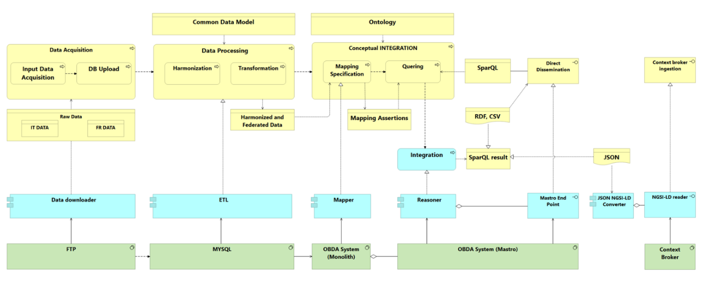
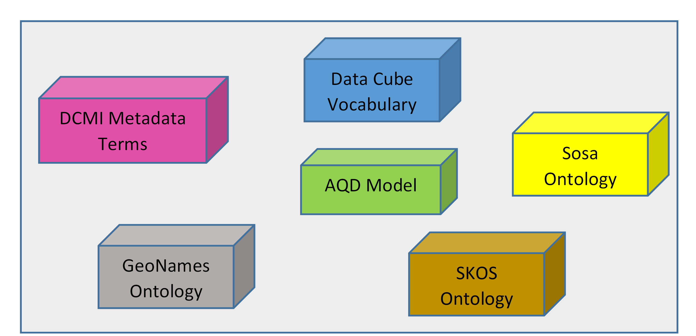

# Deliverable: Milestone 6

## Introduction

### Scope and objectives of the document

This document describes the Interstat pilot services, how they were built and how they can be used. It is part of the Milestone 6 (M6) of the project, which consists in having the "pilot services deployed and working in real environments", and in particular in the availability of the pilot services applications. M6 pertains to Activity 3 of the project ("Pilot services execution and assessment"), which extends until the end of the project with additional milestones dedicated to the monitoring and assessment of the pilots. Therefore, the services and applications will continue to evolve by continuous improvement in the future. It was thus decided to keep this accompanying document relatively short and high-level and to reference where appropriate to the [online resources](https://github.com/INTERSTAT/), much more detailed and which will be kept up to date as the project cotinues to evolve.

The document starts with a short recap about the different pilots and the technical production environment set up for Interstat. General considerations on the development of pilots are then exposed, with a particular focus on the approaches followed for creating the data pipelines and on the technical stack used for the client applications. More detail is then provided for each of the three pilots, including a reminder of the business case, the description of the relevant models and of the data, metadata, pipeline process and client application. A summary of the lessons learned, the remaining problems and the next steps is given in conclusion.

### One-liners on the pilots

- Support for Environmental Policies (SEP): One of the main goals of this use case is to enrich air quality data with demographic analysis, to support local public authorities responsible for environmental policies.
- Geolocalized facilities (GF): dissemination of information about facilities and integration with related sources
- School for You (S4Y): This pilot allows users such as citizens and political decision-makers to discover aggregated data resulting from the integration of several sources about school attendance and the distribution of students in Italy and France.

## Reminder on the production environment

--> ENG
[add short description of the environment]

The client applications developed are one for each pilot service; they are web applications that consume and display SPARQL data.
This section briefly describes the information relating to the production environment, the programming language used for the implementation and the type of repository used to collect the data.

### Programming language adopted for development: ReactJS

React is a JavaScript library for building user interfaces.
The key features are mainly two: the first, is the concept of UI components. The React code is composed of entities called components that are reusable; this means that it is necessary to simply define a component only once, and it can be used multiple times. This makes it much quicker, convenient, and easier to handle the production of a large-scale website. This allows the ability to breakdown complex UI and allow to work on individual components.

The other key feature is that React finds out what changes have been made, and changes only what needs to be changed.
It creates an in-memory data-structure cache, computes the resulting differences, and then updates the browser's displayed DOM (Document Object Model) efficiently. This selective rendering provides a major performance boost. It saves the effort of recalculating the CSS style, layout for the page and rendering for the entire page.

### Type of repository to collect data: GraphDB

GraphDB is a highly efficient and robust graph database with RDF and SPARQL support. In particular, it is an enterprise ready Semantic Graph Database, compliant with W3C Standards. Semantic graph databases (also called RDF triplestores) provide the core infrastructure for solutions where modeling agility, data integration, relationship exploration and cross-enterprise data publishing and consumption are important.

This scalable RDF database, streamlines the load and use of linked data cloud datasets, as well as the own resources. For easy use and compatibility with the industry standards, GraphDB implements the RDF4J framework interfaces, the W3C SPARQL Protocol specification, and supports all RDF serialization formats.
It is one of the few triplestores that can perform semantic inferencing at scale, allowing users to derive new semantic facts from existing facts. It handles massive loads, queries, and inferencing in real time.

In GraphDB data is organized in repositories; once the one of interest has been selected, the data is extracted through the SPARQL query language.
GraphDB also supports SPARQL Federated Query which is an extension of the basic Query Language. Using it, it is possibile to combine a query on a repository in the current instance with a remote call to a different SPARQL endpoint.

The strength of GraphDB is that it is also an HTTP service endpoint that can receive requests and can process SPARQL queries; this service is queried directly by client applications and the requests results are displayed in them.

## Pilot development

In this section, we decribe how the pilot services were created, with a specific focus on the development of the data pipelines and on the client applications.

### Data pipelines

Two different approaches were used for the implementation of the data pipelines: a classical ETL ([Extract, transform, load](https://en.wikipedia.org/wiki/Extract,_transform,_load) pattern for the GF pilot, and an approach based on ontological integration for SEP and S4Y.

#### ETL approach

--> Insee

The GF ETL process was designed with the following principles in mind:

- openness
- maximal automation
- reproduciblity
- efficiency

Openness leads to developping all code on [GitHub](https://github.com/INTERSTAT/Statistics-Contextualized/tree/main/code/Python/gf) starting from the first line, and to using only open source tools.

Maximal automation avoids manual treatments, which saves time and improves traceability. It is often a difficult principle to follow, in particular with messy data, since it requires rigour and a bigger development effort, but it largely pays off in the end, especially if source data changes frequently.

Reproducibility results from automation and from detailed documentation inside and outside code.

Efficiency is ensured by the selection of a technical framework that provides for execution of the pipeline in a distributed environment.

Regarding the tooling, the following choices were made:

- use of [Python 3](https://www.python.org/) as a programming language
- use of [Prefect](https://www.prefect.io/) as a build, run, and monitor framework

Prefect allows for good modularity and readability of the code, and provides process visualisation tools for the conception and execution stages (see the [example](https://github.com/INTERSTAT/Statistics-Contextualized/raw/main/img/gf-flow-design.png) of the "Geolocalized Facilities" pilot). Prefect pipelines can be executed locally, for example for test purposes, or on a [cloud platform](https://www.prefect.io/cloud/) (which can be installed on premises).

More details on the technical environment for the ETL Python implementation is available [here](https://interstat.github.io/Statistics-Contextualized/code/Python/).

#### Domain knowledge approach

The unique pipeline, designed for both pilots and based on Ontology, is described in the following picture. This methodology is generalized and applicable to other use cases, as well as the mixed approach based on both ETLs and data integration through domain ontology (Ontology Based Data Management – OBDM approach).

**Main steps of the pipeline to be implemented for SEP and S4Y pilot:**

1. **Data Acquisition** - Input Data are downloaded from the source websites into a staging area.
   1.1. _Input Data Acquisition_ - Data are downloaded from the web sources either by procedure or manually
   1.2. _DB Upload_ – Data are uploaded into a relational database for data processing.

2. **Data Processing** - Data are harmonized to a common data model through ETL, or transformed to create new variables required for data matching. Several transformations are performed on uploaded data at this stage.
   2.1. _Harmonization_ - Data are harmonized to a common data model through ETL.
   2.2. _Transformation_ - Data aggregation and standardization, unit identification, common variables creation according to target data models, creation of new variables.
   Queries and views implement **ETL Logical level Processes** in the underlying host **MYSQL database**.
   Harmonization and Transformation processes can be run in parallel and the result is stored into **harmonized datasets**.

3. **Conceptual Integration** – Once data are harmonized, they can be integrated. Data are integrated on a conceptual level through the domain ontology. Data are not linked physically but through a SPARQL query, thus the integration is virtual.
   3.1. _Mapping_ – Virtualization process associating physical data to ontology concepts.
   3.2. _Quering_ - Virtual integration by SparQL queries. Results can be exported into the desired format. Data are **federated**, that is to say, they can be viewed as a single coherent set, even when actual data sources vary in format and storage technology.
   The components implementing the **mapper** and the **reasoner** are submodules of an Ontology Based Management System (**OBDA System**).

4. **Direct dissemination** – End point can be used to query and disseminate data in table format or send data to specific applications. They represent the communication interface with the external world.
   End users can query linked data through predefined queries, or by writing new queries, or by selecting the concepts of interest modelled in the ontology, realizing conceptual integration by design (through the Sparqling tool to be integrated in the framework).
   4.1. _SparQL_ – Queries are provided as input to the system through the endpoint interface
   4.2. _SparQL result_ – Results are provided as output through the endpoint interface.

5. **Context Broker Ingestion** – Data exported in JSON can be sent to context broker via a converter module into NGSI-LD format.
   5.1. Queries are provided at design time by the designer when using this endpoint.
   5.2. Resultset must be converted into a specified format JSON NGSI-LD through a dedicated converter module.

Computing Management and Optimization
Tasks can be managed and executed either physically or virtually, to balance the resources for data processing. While physical elaboration is quicker but static, the virtualization is more dynamic but more complex. One example is the conversion of the Geo coordinates in Administrative Units (LAU).
If Virtualization is chosen, GEO SPARQL queries can be integrated into the Ontological framework, and the corresponding LAU can be derived virtually, but this is rather heavy on the reasoner because it must be calculated on the fly at each query. So, one can just statically convert the coordinates through a dedicated service and create a materialized new variable to store LAU and then virtualize it without the need to reference GEO SPARQL.
The main differences between the two approaches concern the different tools used for data harmonization and the methodology applied to obtain and convert integrated data in rdf format. More in detail, in the first approach ETL procedures have been developed in Python, while in the second approach in SqL. In relation to data integration through ontologies, the first approach generates RDF triples from a CSV dataset through Python procedures, while the second approach uses relational DB and Monolith. In addition, while the first approach uses metaontologies (e. g.: SKOS, Data Cube vocabulary), the second approach is based on domain ontologies and then links the concepts of the domain ontology to metaontologies concepts.

### Client applications

The following section describes the services implemented and exposed by the client applications of the three pilots.
The description of them is inserted in tables in which, in particular, they are classified into:

- _Cross-border service_: it compares to a specific indicator or a specific variable in selected Italian and French areas.
- _Cross-domain service_: it allows to link different domains (such as Census and Air Quality) in order to produce new useful information from their combination.

A service can also be both cross-border and cross-domain.

[add screenshots with short description]

## Details by pilot

### Supporting environment policies (SEP)

#### Business case

Suggest to copy/paste from https://github.com/INTERSTAT/Statistics-Contextualized/blob/main/test-case.md#support-for-environment-policies-sep

#### Models

The target data model for census and air quality data, exported in OWL format, combines several existing vocabularies, such as SOSA for sensor description and AQD model for Air pollution. An overview of the ontology structure of census and air quality data is depicted in the following figure:

ONTOLOGY FIGURE

In the modelled ontology, the information objects are colour-coded as follows:

The updated version of the ontology will contain to some metamodels, such as Data Cube Vocabulary and SKOS.

#### Data

This paragraph provides an overview of structural metadata describing the different data sources to be linked.

##### Census data

The SEP pilot plans to combine air quality data with demographic data from the French and Italian censuses. Census data whose metadata are defined by European legislation have been selected in order to minimize interoperability questions and ensure reproductibility at the European level. The explanatory notes for the 2021 census round give details on this subject. In particular, they present a new feature of the 2021 round: the dissemination of population data at the 1 km² grid level, for which Eurostat will provide Inspire metadata and which will be particularly interesting to combine with air quality data.

For testing purposes, it is easier to start with simple data, for example the breakdown of population by age range, sex and geographic local administrative unit. In DDI-CDI terms, census data corresponds to a "Dimensional" (actually "Cube") data structure. The definition of this data structure according to the SDMX model is described [here](https://github.com/INTERSTAT/Statistics-Contextualized/blob/main/pilots/sep/sep-dsd.md).
Italian census data have been extracted from the section of Istat website disseminating the main results of permanent censuses, based on the integration of administrative sources and data collected on a representative sample of municipalities and households (see [here](http://dati-censimentipermanenti.istat.it/?lang=en&SubSessionId=e260034c-92f8-438f-b9f7-737286737689)).

The following table reports the list and the description of the fields extracted and transformed in the data processing step.

| Field name | Description                                              | Data type            |
| ---------- | -------------------------------------------------------- | -------------------- |
| ITTER107   | LAU codes                                                | String               |
| Territory  | LAU names                                                | String               |
| SEXISTAT1  | Gender code                                              | Code list            |
| ETA1       | Age class code                                           | Code list            |
| Age class  | Age class description                                    | Code list            |
| TIME       | Reference year                                           | Year (always ‘2019’) |
| Value      | Value of the resident population in the reference period | Float                |

For France, the data is taken from [here](https://www.insee.fr/fr/statistiques/5395878?sommaire=5395927). The reference year is 2018 for the population counts and 2020 for the reference geography.

##### Italian Air pollution data

The data related to air pollutants have been extracted from the annual reports published by ISPRA, the reference authority for monitoring and assessing air quality in Italy. More in detail, [here](https://annuario.isprambiente.it/sites/default/files/sys_ind_files/indicatori_ada/448/TABELLA%201_PM10_2019_rev.xlsx) is the endpoint to extract data concerning PM10 pollutant.

The subset of fields extracted from the original data source are described below.

| Field name                  | Description                | Data type |
| --------------------------- | -------------------------- | --------- |
| Regione                     | Region Name                | Text      |
| Provincia                   | Department name            | Text      |
| Comune                      | Municipality name          | Text      |
| Nome della stazione         | Name of the Sensor station | Text      |
| Valore medio annuo³ [µg/m³] | Average annual value       | Float     |

##### French Air pollution data

French data concerning PM10 pollutant, collected in 2019 as reference year, are available from the following [link](<http://aidef.apps.eea.europa.eu/?source=%7B%22query%22%3A%7B%22bool%22%3A%7B%22must%22%3A%5B%7B%22term%22%3A%7B%22CountryOrTerritory%22%3A%22France%22%7D%7D%2C%7B%22term%22%3A%7B%22ReportingYear%22%3A%222019%22%7D%7D%2C%7B%22term%22%3A%7B%22Pollutant%22%3A%22Particulate%20matter%20%3C%2010%20%C2%B5m%20(aerosol)%22%7D%7D%5D%7D%7D%2C%22display_type%22%3A%22tabular%22%7D>). Air quality data is available from the European Environment Agency (EEA) at the Air Quality e-Reporting web page. More precisely, the "AIDE F" data flow seems in first approach to be the most relevant for the SEP pilot. The data corresponding to this flow can be General information about the Air Quality e-Reporting products is available in this document. In particular, the description of variables for AIDE F is reproduced below.

The table below lists the fields extracted from the original data source to be transformed in the following steps.

| Field name              | Description                                            | Data type |
| ----------------------- | ------------------------------------------------------ | --------- |
| CountryOrTerritory      | Reporting country                                      | Text      |
| ReportingYear           | LAU names                                              | Year      |
| StationLocalId          | Reference year                                         | Text      |
| SamplingPoint_Latitude  | Sensor station ID                                      | Float     |
| SamplingPoint_Longitude | Latitude of the sampling point                         | Float     |
| Pollutant               | Longitude of the sampling point                        | Code list |
| AggregationType         | Type of aggregation performed on sampling measurements | Code list |
| Unit                    | Measurement unit                                       | Text      |
| AQValue                 | Observed value                                         | Float     |

#### Metadata

Concerning geographic location codes, the classification of Local Administrative Units (LAUs) and European regions according to NUTS (Nomenclature of territorial units for statistics) system is published in Eurostat website, at the following [link](https://ec.europa.eu/eurostat/web/nuts/local-administrative-units).
The description of the code lists of categorical variables extracted from the original data sources are available at the following [link](https://github.com/INTERSTAT/Statistics-Contextualized/tree/main/pilots/sep/sep-dsd-1.ttl).
Most of these code lists are based or compliant with the official statistical classifications available in [RAMON](hhttps://ec.europa.eu/eurostat/ramon/nomenclatures/index.cfm?TargetUrl=LST_NOM&StrGroupCode=CLASSIFIC&StrLanguageCode=EN), the Eurostat's metadata server.
The code lists used for Air quality data are documented in the Eionet Data Dictionary. They are available in SKOS form, with additional information. For example the AQD - Air Quality Pollutants scheme contains also data on recommended unit or measurement equipment for the pollutant.

#### Process

The main steps of the data pipeline of the SEP pilot are:

_**Step 1: Data acquisition**_

Italian and French Air quality data have been extracted from the websites mentioned above. The extracted datasets were uploaded to the FTP area of the project.

_**Step2: Data processing**_

**Census data**

Italian census data have been transformed according to the requested Data Structure through a script in R language, available [here](https://github.com/INTERSTAT/Statistics-Contextualized/files/7539489/Pilot.A.-.census.data.processing.txt). More in detail, data have been filtered and NUTS3 variable has been added using data LAUs codes published on Eurostat website.
Concerning French census data, an R script allows to obtain the CSV file directly from the data published on Insee's web site. The script uses auxiliary CSV files containing reference data about age groups (defined [here](https://github.com/INTERSTAT/Statistics-Contextualized/blob/main/pilots/resources/age-groups.csv)) and French LAU/NUTS (defined [here](https://github.com/INTERSTAT/Statistics-Contextualized/blob/main/pilots/resources/nuts3-fr.csv)) which are also described in the CSVW metadata, available [here](https://github.com/INTERSTAT/Statistics-Contextualized/blob/main/pilots/sep/sep-census.csv-metadata.json).

**Air quality data**

The Data transformation phase was applied only to the dataset related to the PM10 pollutant.
The French dataset about the PM10 taken from the European Environmental Agency and uploaded to the FTP server, in its initial version contains the geographic coordinates; it has been enriched with the Municipality codes through a script in java using the specific service/API.
NUTS3 codes have been added to classify both Italian and French territories, while metadata regarding pollutant type, data reference time and aggregation type have been added in the Italian dataset. Transformation script in R language: processing_ETL_AIR.R.txt
Input files have been uploaded from ftp source as is. Harmonization has been done via SQL union queries wrapped in a single view.

_**Step3: Conceptual integration**_

Data integration is realized on a conceptual level through an Ontology Base Data Access (OBDA) architecture. MySQL is used as data repository for Monolith, the tool implementing this approach and used for data mappings. Specifically, Monolith associates mappings with SQL queries on MySQL database, so that SPARQL queries can be rewritten automatically into SQL queries.

_**Step4: Direct dissemination**_

The tool Monolith can export the queries based on the ontology concepts in XML format. The SPARQL resultset can be formatted in csv, json and rdf and sent to the subsequent stages of the pipeline. RDF triples can be uploaded to INTERSTAT GraphDB for data querying through the client application.

#### SEP Client application (--> ENG)

One of the main goals of this pilot is to enrich air quality information, produced to support local public authorities responsible for environmental policies. More in detail, several decision makers could get insights from the combination of:

- _Sensor data_ measuring the concentration of air pollutants;
- _Statistical data_ describing the structure and the main characteristics of the resident population.

Linking air quality indicators and demographic data could allow decision makers to prioritize target areas of intervention.

| **Service Name**                                                                          | **Description**                                                                                                                                                                                                                                                                                                                                                                 | **Type of data visualization**                                                                                                                                                                                                                                                                                                                                                                                                                                                                                                                                                                                                                                                                                                                                                                                                                                                                                                                                           | **Cross-border service** | **Cross-domain service** |
| ----------------------------------------------------------------------------------------- | ------------------------------------------------------------------------------------------------------------------------------------------------------------------------------------------------------------------------------------------------------------------------------------------------------------------------------------------------------------------------------- | ------------------------------------------------------------------------------------------------------------------------------------------------------------------------------------------------------------------------------------------------------------------------------------------------------------------------------------------------------------------------------------------------------------------------------------------------------------------------------------------------------------------------------------------------------------------------------------------------------------------------------------------------------------------------------------------------------------------------------------------------------------------------------------------------------------------------------------------------------------------------------------------------------------------------------------------------------------------------ | ------------------------ | ------------------------ |
| **Resident population in the most polluted areas**                                        | Through this service the user can obtain the resident population value living in areas where air pollutants exceed the air quality thresholds.                                                                                                                                                                                                                                  | The user will be able to have a map view in which the Municipalities affected by the exceeding of the PM10 limit value will be highlighted. The map is interactive: when the user passes the mouse over the stations concerned, it shows data such as the municipality name in which the station is located and the specific value of the pollutant measured. Additionally, in a table view, the user will be able to view the following specific values: the NUT3 Region involved, the age groups, the population value in each specific NUTS3 region and age group, the Municipalities present in each NUTS3 region in which the overruns were recorded, the relative PM10 value. Thanks to this analysis, efforts to reduce pollution in those areas where the population density is higher can be directed. This service links the Census data with the Air Pollution data and will allow to view the French and Italian data separately.                            | **X**                    | **✔**                    |
| **Evaluation of the pollution effects on specific population groups in Italy and France** | Through this service it will be possible to evaluate the effects of pollution on specific population groups (for example on more vulnerable population groups) by comparing specific areas of Italy and France (for example Rome and Paris).                                                                                                                                    | Through this service, the user has the possibility to select some parameters: a specific NUTS region and/or a specific municipality within it, both Italian and French;a specific age group (for example from 80 to 85 years) to display only the value of the population of that specific age group. The user will have a map in which the selected municipalities will be highlighted. Inside it, the different pollutant registration stations are highlighted. The is interactive: when the user hovers the cursor on the Municipality of interest, the name of the NUTS3 region and the population value of the specific group selected is shown. Furthermore, in a tabular view, the user will be able to view and compare French and Italian data relating to the population and air pollution related to PM10. With this service it is possible to observe, for example, in which regions the most vulnerable population groups are most at risk from pollution. | **✔**                    | **✔**                    |
| **Evaluation of areas with specific values of pollutants in Italy and France**            | Through this service it will be possible to evaluate the presence, or not, of the following pollutants on the French and Italian territory: _PM 10_, _PM 2.5_, _NO2_, _O3_. The user can choose the value of interest for these pollutants. The service allows to compare the number of areas in Italy and France where this presence occurs and the population of these areas. | The user can select a threshold value for each pollutant whose presence he wants to check in areas of the Italian and French territory. Within a map, the NUTS3s (o the Municipalities) containing the stations that have checked the presence of the pollutant values entered by the user, will be highlighted. The map will allow the user to move the cursor over the regions of interest and view the population of the region and the name of the NUTS. In the tabular view, the user can view in detail the pollutants values to which station and region they refer and compare the Italian and French data.                                                                                                                                                                                                                                                                                                                                                      | **✔**                    | **✔**                    |

### Geolocalized facilities (GF)

--> Insee

#### Business case

The main objective of this pilot is to disseminate information about facilities or equipments so that it can be contextualized in space and integrated with other sources of data.

Two specific user stories are defined for the GF pilot:

- In the “visitor” case, we consider a user visiting a place she does not know and wondering where the nearest facilities of different types are located. She also would like to know what events are programmed in the nearby stadiums, theatres of cultural venues. From the description of locations or events, it should be simple to navigate on the web for further detail (e.g. on artists or sport teams, history of places, links to the locations’ web sites, etc.).

- The “local decider” story is about a person in charge of an investment decision at a local level. It can be the manager of a bus company wondering if he should replace an old vehicle, an employee of an educational public service assessing the creation of a new class in a community school, or a young couple thinking of moving to a rural place, etc. He needs information about the level and capacity of the equipment in the neighbourhood, linked with data on the demographic evolution at a fine level. He will probably need to combine that information with other sources more specifically relevant to his specific problem.

#### Models

Copy/paste from https://github.com/INTERSTAT/Statistics-Contextualized/blob/main/pilots/gf/test-case-gf.md#model

#### Data

Copy/paste from https://github.com/INTERSTAT/Statistics-Contextualized/blob/main/pilots/gf/test-case-gf.md#data

#### Metadata

Copy/paste from https://github.com/INTERSTAT/Statistics-Contextualized/blob/main/pilots/gf/test-case-gf.md#metadata

#### Process

Copy/paste from https://github.com/INTERSTAT/Statistics-Contextualized/blob/main/pilots/gf/test-case-gf.md#process

#### GF client application (--> ENG)

The main objective of this pilot is to set up a mechanism for the dissemination and use of information about facilities or equipment, so that the information is contextualized in space and can be integrated with other sources of data.
The _facilities_ are understood as points of services which are accessible to the public and operate in domains like education, health, social services, transport, sports, leisure, culture, or tourism.
Two specific user stories are defined for the GF pilot:

- In the _visitor_ case, we consider a user visiting a place he does not know and wondering where the nearest facilities of different types are located. She also would like to know what events are programmed in the nearby stadiums, theaters of cultural venues.
- The _local decider_ case is about a person in charge of an investment decision at a local level. He needs information about the level and capacity of the equipment in the neighborhood, linked with data on the demographic evolution at a fine level.

| **Service Name**                                                         | **Description**                                                                                                                                                                                                                                                                              | **Type of data visualization**                                                                                                                                                                                                                                                                                                                                                                                                                                                                                                                                                                                                                                                                                                                          | **Cross-border service** | **Cross-domain service** |
| ------------------------------------------------------------------------ | -------------------------------------------------------------------------------------------------------------------------------------------------------------------------------------------------------------------------------------------------------------------------------------------- | ------------------------------------------------------------------------------------------------------------------------------------------------------------------------------------------------------------------------------------------------------------------------------------------------------------------------------------------------------------------------------------------------------------------------------------------------------------------------------------------------------------------------------------------------------------------------------------------------------------------------------------------------------------------------------------------------------------------------------------------------------- | ------------------------ | ------------------------ |
| **A visitor wondering the nearest cultural facilities and events**       | The user is visiting an unknown place, Italian or French, and needs to know the nearest facilities what events are programmed within them. From the description of locations or events, he can browse the web for further detail starting from URLs returned by the application.             | By entering their current position in terms of address and city, users will be able to view the cultural facilities nearby on the map. They are divided according to the type of place and the user can select a certain type of places to be displayed on the map. The first view is therefore the one through the map in which the user can decide to select the place of interest. By selecting a place on the map, the service allows the user to view which events are scheduled for a specific day, chosen by him. The general information of the event is shown.                                                                                                                                                                                 | **X**                    | **✔**                    |
| **Analysis and evaluation of a specific area to finalize an investment** | This service is useful for a user who intends to invest in a certain area (Italian or French). To do this, he may need to know how the territory has evolved in recent years, the trend of the resident population, as well as the number and type of schools present in terms of education. | This service concerns a local decider, a person in charge of an investment decision at a local level. This figure, having to choose a place to make an investment, needs to know the trend or how certain parameters have evolved in recent years. These parameters also concern the demographic evolution at a fine level. Therefore, the service is cross-domain as it combines data of a different nature and it is also cross-border as it allows the user to select two different areas (in Italy and France) to obtain a comparison and to finalize an international business. Therefore, this service does not just show data but also provides analysis tools to support these investors: histograms and graphs are made available to the user. | **✔**                    | **✔**                    |

### The school for you (S4Y)

--> Istat

#### Business case

Suggest to copy/paste from https://github.com/INTERSTAT/Statistics-Contextualized/blob/main/test-case.md#the-school-for-you-s4y

#### Models

The domain concepts about school attendance and school units, are reported in the following ontology, exported as owl and as image.

This ontology contains the class V_group_attendance as istance of metaclass View. An ontological view on the domain allows to aggregate data about the domain for the following measures: number of students, number of schools and by the following dimensions: Isced school level, Scholastic year, Public school, Municipality (Lau).

#### Data

The following paragraph provides an overview of Italian and French data sources linked to test cross-border and cross-domain interoperability. Data extracted for the pilot focus mainly on students enrollment and school location.

##### Italian School data

The Italian data used for the pilot belong to the [MIUR (The Ministry for Education) catalogue](https://dati.istruzione.it/opendata/). The datasets, extracted in RDF format and concerning both public and private schools, provide the following information:

- [Registry information on schools](https://dati.istruzione.it/opendata/ricerca/?searchinput=SCUANAGRAFE&lg=%24lang) (Informazioni anagrafiche scuole statali, Informazioni anagrafiche scuole paritarie);
- [Students by course year and age group](https://dati.istruzione.it/opendata/ricerca/?searchinput=ALUCORSOETA&lg=%24lang) (Studenti per anno di corso e fascia di eta'. Scuola statale, Studenti per anno di corso e fascia di età. Scuola paritaria);
  The reference dataset for the list and location of schools of all levels is available [here](https://dati.istruzione.it/opendata/ricerca/?searchinput=EDIANAGRAFESTA&lg=) and is also considered for the GF pilot. The coordinates of the schools have been added to this dataset and the output file is present in the [FTP area of the project](https://interstat.eng.it/files/gf/).

The following table reports the subset of fields extracted from the [Registry information on schools](https://dati.istruzione.it/opendata/ricerca/?searchinput=SCUANAGRAFE&lg=%24lang).

| Field name                                | Description                     | Data type |
| ----------------------------------------- | ------------------------------- | --------- |
| ANNOSCOLASTICO                            | Scholastic year                 | Numeric   |
| CODICESCUOLA                              | School identifier               | Text      |
| DENOMINAZIONESCUOLA                       | School name                     | Text      |
| INDIRIZZOSCUOLA                           | School address                  | Text      |
| CODICECOMUNESCUOLA                        | School cadastral code           | Text      |
| DESCRIZIONETIPOLOGIAGRADOISTRUZIONESCUOLA | Level of educational attainment | Text      |

For the available scholastic years, the number of students has been extracted from the following dataset:

- [Students by course year and age group](https://dati.istruzione.it/opendata/ricerca/?searchinput=ALUCORSOETA&lg=%24lang).

The variables extracted for data integration are reported in the table below.

| Field name  | Description        | Data type |
| ----------- | ------------------ | --------- |
| ANN_SCO_RIF | Scholastic year    | Numeric   |
| COD_PLE_UTE | School identifier  | Text      |
| QTY_NUM_ALU | Number of students | Text      |

##### French School data

The following fields have been extracted from the school registry [dataset](https://data.education.gouv.fr/explore/dataset/fr-en-adresse-et-geolocalisation-etablissements-premier-et-second-degre/table/?disjunctive.nature_uai&disjunctive.nature_uai_libe&disjunctive.code_departement&disjunctive.code_region&disjunctive.code_academie&disjunctive.secteur_prive_code_type_contrat&disjunctive.secteur_prive_libelle_type_contrat&disjunctive.code_ministere&disjunctive.libelle_ministere) (called "Address and geolocalization of primary and secondary educational institutions"). Data extraction is performed using the API to retrieve a CSV file.

The number of students for the three last scholastic year (2019, 2020 and 2021) has been extracted from four datasets:

- [Student enrollment by grade and number of classes per school](https://data.education.gouv.fr/explore/dataset/fr-en-ecoles-effectifs-nb_classes/table/?disjunctive.rentree_scolaire&disjunctive.region_academique&disjunctive.academie&disjunctive.departement&disjunctive.commune&disjunctive.numero_ecole&disjunctive.denomination_principale&disjunctive.patronyme&disjunctive.secteur&disjunctive.code_postal&sort=tri) (only primary and nursery school).
- [Number of students by grade, gender, most frequent modern languages 1 and 2, by lower secondary school](https://data.education.gouv.fr/explore/dataset/fr-en-college-effectifs-niveau-sexe-lv/table/?disjunctive.rentree_scolaire&disjunctive.region_academique&disjunctive.academie&disjunctive.departement&disjunctive.commune&disjunctive.numero_college&disjunctive.denomination_principale&disjunctive.patronyme&disjunctive.secteur&disjunctive.rep&disjunctive.rep_plus).
- [Number of students by grade, gender, most frequent modern languages 1 and 2, by upper secondary school](https://data.education.gouv.fr/explore/dataset/fr-en-lycee_gt-effectifs-niveau-sexe-lv/table/?disjunctive.rentree_scolaire&disjunctive.region_academique&disjunctive.academie&disjunctive.departement&disjunctive.commune&disjunctive.numero_lycee&disjunctive.denomination_principale&disjunctive.patronyme&disjunctive.secteur) (school of general and technological education).
- [Number of students by grade, gender, most frequent modern languages 1 and 2, by upper secondary school](https://data.education.gouv.fr/explore/dataset/fr-en-lycee_pro-effectifs-niveau-sexe-lv/table/?disjunctive.rentree_scolaire&disjunctive.region_academique&disjunctive.academie&disjunctive.departement&disjunctive.commune&disjunctive.numero_lycee&disjunctive.denomination_principale&disjunctive.patronyme&disjunctive.secteur) (vocational school).

Data extraction is performed based CSV files directly available online. Variables finally extracted are:

| Field name       | Description                                      | Data type                                                     | Comment                                                                                         |
| ---------------- | ------------------------------------------------ | ------------------------------------------------------------- | ----------------------------------------------------------------------------------------------- |
| school_id        | Unique school identifier                         | String                                                        | variable "numero_uai" in the dataset n°1                                                        |
| name             | Official name of the school                      | String                                                        | variable "appellation_officielle in the dataset n°1                                             |
| latitude         | Latitude of the school (WGS84)                   | Float                                                         | variable "latitude" in the dataset n°1                                                          |
| longitude        | Longitude of the school (WGS84)                  | Float                                                         | variable "longitude" in the dataset n°1                                                         |
| lau              | Lau code                                         | Code list                                                     | variable "code_commune" in the dataset n°1                                                      |
| institution_type | Type of institution                              | Code list (Coded as "PR" for "Private" and "PU" for "Public") | variable "secteur_public_prive_libe" in the dataset n°1                                         |
| code_nature      | Nature code                                      | Code list                                                     | variable "nature_uai" in the dataset n°1                                                        |
| ISCED_level      | Level of ISCED classification                    | Code list                                                     | coded based on code_nature (see mapping file [here](https://interstat.eng.it/files/s4y/input/)) |
| scholastic_year  | Scholastic year                                  | Year                                                          | Datasets n°2 to n°5                                                                             |
| students_number  | Number of students (measure) per scholastic year | Integer                                                       | Datasets n°2 to n°5                                                                             |

#### Metadata

ISCED (International Standard Classification of Education) refers to the national (and sub-national) education programme and the related recognised educational qualification.

[Link to map the classifications of different countries](http://uis.unesco.org/en/isced-mappings)
[Mapping ISCED (CITE) – French data](http://uis.unesco.org/sites/default/files/documents/isced-2011-fr.pdf)

**Educational attainment level**: low education, medium education, high education
**ISCED attainment level**
_Low education_

- ISCED 0: Early childhood education (‘less than primary’ for educational attainment)
- ISCED 1: Primary education
- ISCED 2: Lower secondary education
  _Medium education_
- ISCED 3: Upper secondary education
- ISCED 4: Post-secondary non-tertiary educ
  _High education_
- ISCED 5: Short-cycle tertiary education
- ISCED 6: Bachelor’s or equivalent level
- ISCED 7: Master’s or equivalent level
- ISCED 8: Doctoral or equivalent level

Institution type { public = 1, private = 0 }

Metadata and harmonization outline are provided in the excel file [S4Y-SchoolRegistry.meta.xlsx](https://github.com/INTERSTAT/Statistics-Contextualized/files/8471721/S4Y-SchoolRegistry.meta.xlsx).

#### Process

The main steps of the data pipeline are:

_**Step 1: Data acquisition**_

Italian and French data have been extracted from the websites mentioned above. The extracted datasets were uploaded to the FTP area of the project.
At the moment the datasets referring to the year 2019 have been loaded, but all the school years could be considered and added in order to allow the user to make an analysis of the data over time.
The ETL process producing French data file is organized according to the usual steps:
Extraction is performed on data which are all available online: CSV retrived using API for school registry and CSV directly downloaded for four other datasets.

The main transformation steps are:

- recoding institution type and coding ISCED level based on a mapping file
- merging school registry dataset and students number datasets
- producing CSV file
  CSV data file is finally uploaded to the Interstat [FTP server](https://interstat.eng.it/files/s4y/output/).

_**Step2: Data processing**_

Some variables have been created or extracted by ad-hoc services/API. More in detail:

- IT coordinates have been processed through a geo converter service from Address and LAU or ZIP-CODE
- IT School Year has been converted to a standard format
- IT information about the school being public or private has been added
- FR School Year has been extracted from other sources.

_**Step3: Conceptual and logical integration**_
On a conceptual level, Italian and French data have been integrated through ontology concepts. Starting from the conceptual integration achieved through ontology, the main goal of the common logical model is to harmonize cross domain and cross border data sources.
The common logical model has the following structure:

| Table                 | Field              | Is part of key | Description                                                                                                                     |
| --------------------- | ------------------ | -------------- | ------------------------------------------------------------------------------------------------------------------------------- | --- |
| V_school_unit         | school_id          | True           | Code to identify one school unit. The code is unique on different countries                                                     |
| V_school_unit         | school_name        |                |                                                                                                                                 |
| V_school_unit         | In_lau             |                | Municipality (LAU code) of school. The code is unique on different countries                                                    |
| V_school_unit         | Institution_type   |                | For public schools is 1, otherwise 0                                                                                            |
| V_school_unit         | ISCED_school_code  |                | ISCED code of prevalent Education level provided by the school. Prevalent because a school could provide many education levels. |
| V_students_attendance | school_id          | True           | Identifier of School unit. Attendances of students for one School unit and for one scolastic year                               |     |
| V_students_attendance | scholastic_year    | True           | Identifier of sclolastic year (first of year couple)                                                                            |
| V_students_attendance | number_of_students |                | Number of students attending                                                                                                    |

Data from the original data sources have been transformed and harmonized according to the common logical model. The diagram below describes how data have been transformed and loaded in the following objects: V_school_unit, V_students_attendance and V_group_attendance, which is the information object resulting from the conceptual integration.

_**Step4: Direct dissemination**_

See the description of SEP data pipeline.

#### SFY client application (--> ENG)

This pilot allows users such as citizens and political decision-makers to discover aggregated data resulting from the integration of several sources about school attendance and the distribution of students in Italy and France.

| **Service Name**                                                                                  | **Description**                                                                                                                                                                                                                                                                                                                                                                                                                                                                                                                                                                                             | **Type of data visualization**                                                                                                                                                                                                                                                                                                                                                                                                                                                    | **Cross-border service** | **Cross-domain service** |
| ------------------------------------------------------------------------------------------------- | ----------------------------------------------------------------------------------------------------------------------------------------------------------------------------------------------------------------------------------------------------------------------------------------------------------------------------------------------------------------------------------------------------------------------------------------------------------------------------------------------------------------------------------------------------------------------------------------------------------- | --------------------------------------------------------------------------------------------------------------------------------------------------------------------------------------------------------------------------------------------------------------------------------------------------------------------------------------------------------------------------------------------------------------------------------------------------------------------------------- | ------------------------ | ------------------------ |
| **Analysis of resident population and schools in a specific Municipality**                        | This service allows to explore the number of schools and students in a selected area, according to the main level of educational attainment. This analysis may enhance the coverage of scholar services in a selected municipality and the relationship between school attendance and the population structure resulting from census data. This Analysis may support policy makers to improve access to education trainings and facilities in specific areas.                                                                                                                                               | The user can select a Municipality, an Educational Level (ISCED) and a School Year (it can be selected among many years but for now there is only 2020). The number of Schools, the number of Students and the resident population (divided by age group) are obtained, in tabular form. The locations of the schools in the selected Municipality are displayed on the map.                                                                                                      | **X**                    | **✔**                    |
| **Distribution of public and private schools: comparison between Italian and French territories** | The main goal of this service is to compare the distribution of private and public schools in selected Municipalities in France and Italy. This service allows to explore the number of public and private schools, comparing two specific municipalities, an Italian and a French one. This analysis may enhance the coverage of public and private scholar services in a selected area in relation also with the population resident resulting from census data. The aim is also to provide the ratio between public and private schools in those specific areas in the form of a percentage composition. | The user can select an Italian and a French Municipality and a School year. The number of public schools, private schools and the value of the resident population in the specific areas are obtained. Public and private schools are geolocated on the map in the specific selected municipalities, also associating the resident population. Finally, the percentage composition of public and private schools is displayed, among the totals, in both selected municipalities. | **✔**                    | **✔**                    |

## Conclusions

### Lessons learned

- Most of the time on data cleaning (common finding)
- Some important data are still not easily accessible (-> link to EC data strategy, HVD...)
- Importance of metadata

### Remaining problems

- difficulties with the Context Broker (_do we want to mention that?_)

### Next steps

- continuous improvement of pilots (document, automate, add sources, pimp client)
- assessment framework
- work on the context broker, especially at the model level (mention work on SDMX/NGSI-LD)
