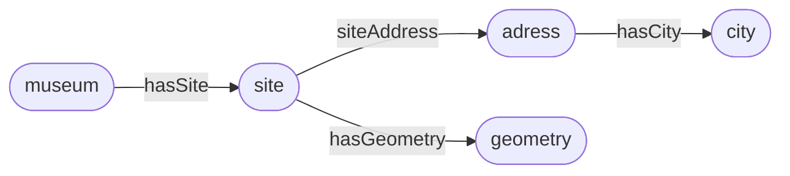
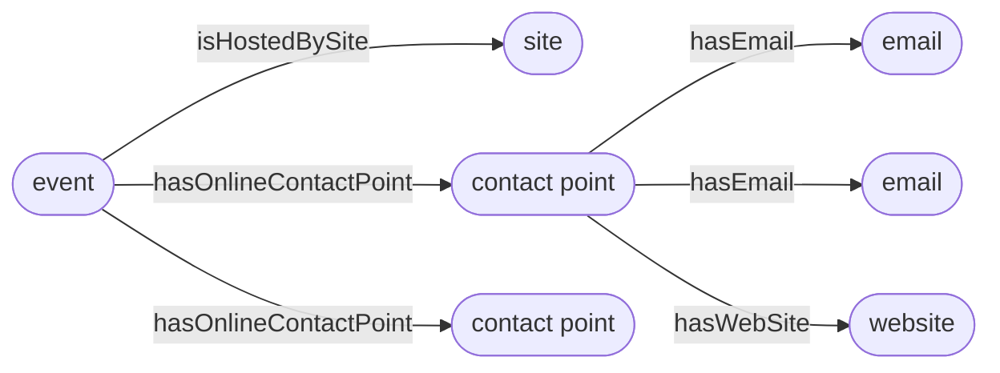

# Example of MIBACT data

Here are examples of SPARQL DESCRIBE queries and corresponding Turtle results. Queries are executed on the "Dati Cultura" [SPARQL endpoint](https://dati.cultura.gov.it/sparql).

For brevity and readability:
* well-known prefixes (`rdf`, `rdfs`, `owl`, `dc`, `foaf`) are not declared
* results are limited to the statements of which the resource is subject.
* some triples are omitted in the results concerning e-mails

## Musea

The following queries return information on one given museum and some linked resources. The following diagram represents the associations between the different individuals.




### Museum

#### Query

```sparql
DESCRIBE <http://dati.beniculturali.it/mibact/luoghi/resource/CulturalInstituteOrSite/100000>
```

#### Results

```sparql
@prefix cis: <http://dati.beniculturali.it/cis/> .
@prefix ns3: <http://dati.beniculturali.it/mibact/luoghi/resource/Site/> .
@prefix ns4: <http://dati.beniculturali.it/mibact/luoghi/resource/SubjectDiscipline/> .
@prefix geo: <http://www.w3.org/2003/01/geo/wgs84_pos#> .
@prefix clvapit: <https://w3id.org/italia/onto/CLV/> .
@prefix ns9: <http://dati.beniculturali.it/mibact/luoghi/resource/Geometry/> .
@prefix l0: <https://w3id.org/italia/onto/l0/> .
@prefix accessCondition: <https://w3id.org/italia/onto/AccessCondition/> .
@prefix ns12: <http://dati.beniculturali.it/mibact/luoghi/resource/OpeningHoursSpecification/> .
@prefix ns13: <http://dati.beniculturali.it/mibact/luoghi/resource/Booking/> .
@prefix smapit: <https://w3id.org/italia/onto/SM/> .
@prefix ns15: <http://dati.beniculturali.it/mibact/luoghi/resource/OnlineContactPoint/> .
@prefix roapit: <https://w3id.org/italia/onto/RO/> .
@prefix ns17: <http://dati.beniculturali.it/mibact/luoghi/resource/RoleInTime/> .

<http://dati.beniculturali.it/mibact/luoghi/resource/CulturalInstituteOrSite/100000> rdf:type cis:CulturalInstituteOrSite ;
    rdfs:label "Museo civico aufidenate \"Antonio De Nino\""@it ;
    cis:hasSite ns3:Sede_di_100000 ;
    cis:hasDiscipline ns4:Contenuti_Editoriali ;
    geo:lat "41.734238" ;
    geo:long "14.032534" ;
    foaf:depiction <http://media.beniculturali.it/mibac/files/boards/388a5474724a15af0ace7a40ab3301de/museo%20civico2.JPG> ;
    dc:type "Museo, Galleria e/o raccolta" ;
    clvapit:hasGeometry ns9:Coordinate_geografiche_della_sede_di_Museo_civico_aufidenate__Antonio_De_Nino__100000 ;
    l0:identifier "DBUnico.100000" ;
    cis:hasCISNameInTime <http://dati.beniculturali.it/mibact/luoghi/resource/CISNameInTime/100000> ;
    cis:institutionalCISName "Museo civico aufidenate \"Antonio De Nino\""@it ;
    accessCondition:hasAccessCondition ns12:Chiusura_100000 ;
    accessCondition:hasAccessCondition ns13:None ;
    smapit:hasOnlineContactPoint ns15:http___www_comune_alfedena_aq_it-protocollo_comune_alfedena_aq_it-0864_87114 ;
    l0:description "Il museo, fondato nel 1897, conserva i reperti pi\u00F9 importanti degli scavi effettuati nella necropoli sannita di Alfedena-Campo Consolino.\u00A0Le campagne di scavo, avviate da Lucio Mariani alla fine del XIX secolo, hanno portato alla luce sepolture a inumazione dal VI al IV secolo a.C. e ricchi corredi funerari; di particolare interesse un cinturone in bronzo, una corazza sannitica a tre dischi e due kardiophylakes."@it ;
    ns17:_enteProprietario_100000 roapit:forEntity <http://dati.beniculturali.it/mibact/luoghi/resource/CulturalInstituteOrSite/100000> ;
    ns17:Mibac_enteCompetenteTutela_100000 roapit:forEntity <http://dati.beniculturali.it/mibact/luoghi/resource/CulturalInstituteOrSite/100000> .
```

### Site

#### Query

```sparql
DESCRIBE <http://dati.beniculturali.it/mibact/luoghi/resource/Site/Sede_di_100000>
```

#### Results

```sparql
@prefix ns1: <http://dati.beniculturali.it/mibact/luoghi/resource/Site/> .
@prefix cis: <http://dati.beniculturali.it/cis/> .
@prefix ns4: <http://dati.beniculturali.it/mibact/luoghi/resource/Address/> .
@prefix clvapit: <https://w3id.org/italia/onto/CLV/> .
@prefix ns6: <http://dati.beniculturali.it/mibact/luoghi/resource/Geometry/> .
@prefix l0: <https://w3id.org/italia/onto/l0/> .

ns1:Sede_di_100000 rdf:type cis:Site ;
    rdfs:label "Sede di Museo civico aufidenate \"Antonio De Nino\""@it ;
    cis:siteAddress ns4:Indirizzo_della_sede_di_Museo_civico_aufidenate__Antonio_De_Nino__100000 ;
    clvapit:hasGeometry ns6:Coordinate_geografiche_della_sede_di_Museo_civico_aufidenate__Antonio_De_Nino__100000 ;
    l0:name "Sede di Museo civico aufidenate \"Antonio De Nino\""@it .
```

### Site address

#### Query

```sparql
DESCRIBE <http://dati.beniculturali.it/mibact/luoghi/resource/Address/Indirizzo_della_sede_di_Museo_civico_aufidenate__Antonio_De_Nino__100000>
```

#### Results

```sparql
@prefix ns1: <http://dati.beniculturali.it/mibact/luoghi/resource/Address/> .
@prefix ns4: <http://dati.beniculturali.it/mibact/luoghi/resource/Province/> .
@prefix clvapit: <https://w3id.org/italia/onto/CLV/> .
@prefix ns5: <http://dati.beniculturali.it/mibact/luoghi/resource/Region/> .
@prefix ns6: <http://dati.beniculturali.it/mibact/luoghi/resource/Country/> .
@prefix ns7: <http://dati.beniculturali.it/mibact/luoghi/resource/City/> .

ns1:Indirizzo_della_sede_di_Museo_civico_aufidenate__Antonio_De_Nino__100000 rdf:type clvapit:Address ;
    rdfs:label "Indirizzo della Sede di: Museo civico aufidenate \"Antonio De Nino\""@it ;
    clvapit:hasProvince ns4:L_Aquila ;
    clvapit:hasRegion ns5:Abruzzo ;
    clvapit:fullAddress "Viale Mansueto De Amicis - Alfedena" ;
    clvapit:hasCountry ns6:Italia ;
    clvapit:postCode "67030" ;
    clvapit:hasCity ns7:Alfedena ;
    clvapit:hasStreetToponym <http://dati.beniculturali.it/mibact/luoghi/resource/StreetToponym/100000> .
```

### Site geometry

#### Query

```sparql
DESCRIBE <http://dati.beniculturali.it/mibact/luoghi/resource/Geometry/Coordinate_geografiche_della_sede_di_Museo_civico_aufidenate__Antonio_De_Nino__100000>
```

#### Results

```sparql
@prefix ns1: <http://dati.beniculturali.it/mibact/luoghi/resource/Geometry/> .
@prefix clvapit: <https://w3id.org/italia/onto/CLV/> .
@prefix ns4: <http://dati.beniculturali.it/mibact/luoghi/resource/GeometryType/> .
@prefix ns5: <http://dati.beniculturali.it/mibact/luoghi/resource/Site/> .

ns1:Coordinate_geografiche_della_sede_di_Museo_civico_aufidenate__Antonio_De_Nino__100000 rdf:type clvapit:Geometry ;
    rdfs:label "Coordinate geografiche della Sede di: Museo civico aufidenate \"Antonio De Nino\""@it ;
    clvapit:hasGeometryType ns4:Point ;
    clvapit:lat "41.734238" ;
    clvapit:long "14.032534" .
```


### City

#### Query

```sparql
DESCRIBE <http://dati.beniculturali.it/mibact/luoghi/resource/City/Alfedena>
```

#### Results

```sparql
@prefix clvapit: <https://w3id.org/italia/onto/CLV/> .
@prefix ns1: <http://dati.beniculturali.it/mibact/luoghi/resource/Address/> .
@prefix ns2: <http://dati.beniculturali.it/mibact/luoghi/resource/City/> .
@prefix ns4: <https://w3id.org/arco/resource/City/> .
@prefix ns5: <http://dati.beniculturali.it/iccd/fotografico/resource/City/> .
@prefix ns8: <http://dati.beniculturali.it/mibact/luoghi/resource/Province/> .
@prefix l0: <https://w3id.org/italia/onto/l0/> .

ns2:Alfedena rdf:type clvapit:City ;
    clvapit:Feature ;
    rdfs:label "Alfedena" ;
    owl:sameAs ns4:alfedena , <http://dati.beniculturali.it/iccu/anagrafe/resource/City/066003> , ns5:alfedena ;
    clvapit:hasHigherRank ns8:L_Aquila ;
    l0:name "Alfedena" .
```

## Events

The following queries return information on one given event and some linked resources. The following diagram represents the associations between the different individuals.



### Event

#### Query

```sparql
DESCRIBE <http://dati.beniculturali.it/mibact/eventi/resource/CulturalEvent/849>
```

#### Results

```sparql
@prefix cis: <http://dati.beniculturali.it/cis/> .
@prefix l0: <https://w3id.org/italia/onto/l0/> .
@prefix ns4: <http://dati.beniculturali.it/mibact/eventi/resource/Site/> .
@prefix tiapit: <https://w3id.org/italia/onto/TI/> .
@prefix ns7: <http://dati.beniculturali.it/mibact/eventi/resource/TimeInterval/> .
@prefix accessCondition: <https://w3id.org/italia/onto/AccessCondition/> .
@prefix ns9: <http://dati.beniculturali.it/mibact/eventi/resource/Booking/> .
@prefix potapit: <https://w3id.org/italia/onto/POT/> .
@prefix smapit: <https://w3id.org/italia/onto/SM/> .

<http://dati.beniculturali.it/mibact/eventi/resource/CulturalEvent/849> rdf:type cis:CulturalEvent ;
    rdfs:label "Il Valturio del 1483"@it ;
    rdfs:comment "I libri si raccontano[...] sezione Campania."@it ;
    dc:type "Incontro/presentazione" ;
    cis:isHostedBySite ns4:Sede_di_849 ;
    l0:name "Il Valturio del 1483"@it ;
    tiapit:atTime ns7:Durata_di_849 ;
    accessCondition:hasAccessCondition ns9:None ;
    potapit:hasTicket <http://dati.beniculturali.it/mibact/eventi/resource/Ticket/849_Base> ;
    smapit:hasOnlineContactPoint <http://dati.beniculturali.it/mibact/eventi/resource/OnlineContactPoint/Biglietteria/849> , <http://dati.beniculturali.it/mibact/eventi/resource/OnlineContactPoint/849> ;
    l0:description "I libri si raccontano[...] sezione Campania."@it .
```

### Site

#### Query

```sparql
DESCRIBE <http://dati.beniculturali.it/mibact/eventi/resource/Site/Sede_di_849>
```

#### Results

```sparql
@prefix cis: <http://dati.beniculturali.it/cis/> .
@prefix l0: <https://w3id.org/italia/onto/l0/> .
@prefix ns1: <http://dati.beniculturali.it/mibact/luoghi/resource/Site/> .
@prefix ns6: <http://dati.beniculturali.it/mibact/eventi/resource/Address/> .

ns1:Sede_di_849 rdf:type cis:Site .
    rdfs:label "Sede di Biblioteca Universitaria di Napoli"@it ;
    owl:sameAs ns1:Sede_di_117123 ;
    cis:siteAddress ns6:Indirizzo_della_sede_di_Biblioteca_Universitaria_di_Napoli849 ;
    l0:name "Sede di Biblioteca Universitaria di Napoli"@it .
```

### Contact points

#### Queries

```sparql
DESCRIBE <http://dati.beniculturali.it/mibact/eventi/resource/OnlineContactPoint/849>
```

```sparql
DESCRIBE <http://dati.beniculturali.it/mibact/eventi/resource/OnlineContactPoint/849>
```

#### Results

```sparql
@prefix smapit: <https://w3id.org/italia/onto/SM/> .
@prefix ns1: <http://dati.beniculturali.it/mibact/eventi/resource/Email/> .
@prefix ns4: <http://dati.beniculturali.it/mibact/eventi/resource/Telephone/> .
@prefix ns5: <http://dati.beniculturali.it/mibact/eventi/resource/WebSite/> .

<http://dati.beniculturali.it/mibact/eventi/resource/OnlineContactPoint/849> rdf:type smapit:OnlineContactPoint ;
    rdfs:label "Contact Point Il Valturio del 1483" ;
    smapit:hasEmail ns1:mbac-bu-na_mailcert_beniculturali_it , ns1:bu-na_promozioneculturale_beniculturali_it ;
    smapit:hasTelephone ns4:_39_081_5517025 , ns4:_39_0815528275 ;
    smapit:hasWebSite ns5:http___www_bibliotecauniversitarianapoli_beniculturali_it_ .
```

```sparql
@prefix smapit: <https://w3id.org/italia/onto/SM/> .
<http://dati.beniculturali.it/mibact/eventi/resource/OnlineContactPoint/Biglietteria/849> rdf:type smapit:OnlineContactPoint ;
    rdfs:label "Bibglietteria Il Valturio del 1483" .
```


### Emails

#### Queries

```sparql
DESCRIBE <http://dati.beniculturali.it/mibact/eventi/resource/Email/mbac-bu-na_mailcert_beniculturali_it>
```

```sparql
DESCRIBE <http://dati.beniculturali.it/mibact/eventi/resource/Email/bu-na_promozioneculturale_beniculturali_it>
```

#### Results

```sparql
@prefix smapit: <https://w3id.org/italia/onto/SM/> .
@prefix ns1: <http://dati.beniculturali.it/mibact/eventi/resource/Email/> .

ns1:mbac-bu-na_mailcert_beniculturali_it rdf:type smapit:Email ;
    smapit:emailAddress "mailto:mbac-bu-na@mailcert.beniculturali.it" ;
    smapit:hasEmailType <https://w3id.org/italia/controlled-vocabulary/classifications-for-public-services/channel/042> ;
    smapit:isEmailOf <http://dati.beniculturali.it/mibact/eventi/resource/OnlineContactPoint/2227> ,
    <http://dati.beniculturali.it/mibact/eventi/resource/OnlineContactPoint/849> .
```

```sparql
@prefix ns1: <http://dati.beniculturali.it/mibact/eventi/resource/Email/> .
@prefix smapit: <https://w3id.org/italia/onto/SM/> .
ns1:bu-na_promozioneculturale_beniculturali_it rdf:type smapit:Email ;
    smapit:emailAddress "mailto:bu-na.promozioneculturale@beniculturali.it" ;
    smapit:hasEmailType <https://w3id.org/italia/controlled-vocabulary/classifications-for-public-services/channel/042> ;
    smapit:isEmailOf <http://dati.beniculturali.it/mibact/eventi/resource/OnlineContactPoint/Biglietteria/8384> ,
    <http://dati.beniculturali.it/mibact/eventi/resource/OnlineContactPoint/849>  .
```

### Website

#### Query

```sparql
DESCRIBE <http://dati.beniculturali.it/mibact/eventi/resource/WebSite/http___www_bibliotecauniversitarianapoli_beniculturali_it_>
```

#### Results

```sparql
@prefix ns1: <http://dati.beniculturali.it/mibact/eventi/resource/WebSite/> .
@prefix smapit: <https://w3id.org/italia/onto/SM/> .

ns1:http___www_bibliotecauniversitarianapoli_beniculturali_it_ rdf:type smapit:WebSite ;
    smapit:URL "http://www.bibliotecauniversitarianapoli.beniculturali.it/" .
```
