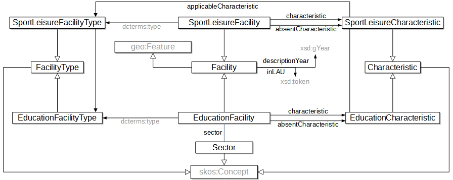
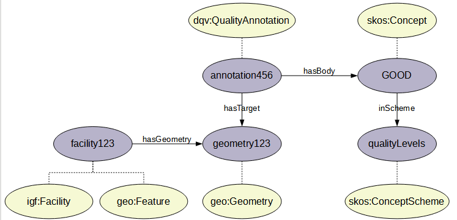

# Geolocalized Facilities (GF) Interstat pilot

## Data

### French data

The central source of French data for this pilot is the Permanent database of facilities ([BPE](https://www.insee.fr/en/metadonnees/source/serie/s1161) in French) published by Insee. For a working example, we extract a list of columns from the CSV file containing the data from the 2020 edition of the database.

BPE data and metadata are available in CSV formats from the BPE [landing page](https://www.insee.fr/fr/statistiques/3568638?sommaire=3568656). More specifically, the example uses an extract of the following geocoded facilities:
- (dataset 1) Exposition venues and heritage, file available [here (filter TYPEQU="F309")](https://www.insee.fr/fr/statistiques/fichier/3568638/bpe20_sport_Loisir_xy_csv.zip)
- (dataset 2) Education, file available [here](https://www.insee.fr/fr/statistiques/fichier/3568638/bpe20_enseignement_xy_csv.zip)

The extraction is performed directly from the online CSV files by a [Python script](https://github.com/INTERSTAT/Statistics-Contextualized/blob/main/code/Python/gf/bpe_extraction.py).

The list of columns extracted is given in the following table.

| Field name | Description | Data type | Data availability |
| --- | -- | --- |-------------------|
| Facility_ID | Facility identifier | String | Datasets 1 & 2 |
| Year | Reference year | Year (always '2020') | Datasets 1 & 2 |
| LAU | Municipality | Code list | Datasets 1 & 2 |
| Coord_X | Latitude | Float | Datasets 1 & 2 |
| Coord_Y | Longitude | Float | Datasets 1 & 2 |
| Quality_XY | Quality of geocoding | Code list | Datasets 1 & 2 |
| Facility_Type | Type of facility | Code list | Datasets 1 & 2 |
| CL_PELEM | Presence or absence of a pre-elementary class in primary schools | Code list | Dataset 2 |
| CL_PGE | Presence or absence of a preparatory class for the high schools in upper secondary | Code list | Dataset 2 |
| EP | Membership or not in a priority education scheme | Code list | Dataset 2 |
| Sector | Membership of the public or private education sector | Code list | Dataset 2 |

French geographic coordinates are expressed using the [Lambert](https://en.wikipedia.org/wiki/Lambert_conformal_conic_projection) [93](https://spatialreference.org/ref/epsg/rgf93-lambert-93/) coordinate system.


### Italian data

#### Musea

The data on Italian musea is extracted from the https://dati.cultura.gov.it/ web site published by the Ministero della Cultura, and more precisely from the [SPARQL endpoint](https://dati.cultura.gov.it/sparql). The columns extracted are:

| Field name         | Description        | Data type | Property path                                              |
|--------------------|--------------------|-----------|------------------------------------------------------------|
| subject            | Museum             | URI       | (a cis:CulturalInstituteOrSite)                            |
| Nome_Istituzionale | Institutional name | String    | cis:institutionalCISName                                   |
| Descrizione        | Description        | String    | lo:description                                             |
| Latitudine         | Latitude           | String    | geo:lat                                                    |
| Longitudine        | Longitude          | String    | geo:long                                                   |
| Disciplina         | Discipline         | String    | cis:hasDiscipline/l0:name                                  |
| Indirizzo          | Address            | String    | cis:hasSite/cis:siteAddress/clvapit:fullAddress            |
| Codice_postale     | Postal code        | String    | cis:hasSite/cis:siteAddress/clvapit:postCode               |
| Comune             | Municipality name  | String    | cis:hasSite/cis:siteAddress/clvapit:hasCity/rdfs:label     |
| Provincia          | Province name      | String    | cis:hasSite/cis:siteAddress/clvapit:hasProvince/rdfs:label |
| WebSite            | Web site           | String    | smapit:hasOnlineContactPoint/smapit:hasWebSite/smapit:URL  |

The "Property path" column refers to the RDF property or path of properties giving the field value in reference to the [Cultural-ON](https://dati.cultura.gov.it/cultural-ON/ENG.html) ontology and the vocabularies it relies on. There are some adjustments made, for example `institutionalCISName` instead of `institutionalName`. An [example](mibact-data.md) of RDF data provides additional detail, along with the namespaces associated to the prefixes used in the table.


#### Events

The data on Italian cultural events is also extracted by a query on the SPARQL endpoint at https://dati.cultura.gov.it/sparql. The columns extracted are:

| Field name | Description | Data type |
| --- | -- | --- |
| EVENTO | Event identifier | URI |
| NOME | Name of the event | String |
| DATA_INIZIO_EVENTO | Starting date of the event | Datetime |
| DATA_FINE_EVENTO | Ending date of the event | Datetime |
| CATEGORIA | Type of event | Code list |
| SITO_WEB | Web site | HTTP URI or domain name |
| EMAIL | Email address | Mailto URI |
| VIA | Street name | String |
| NUMERO_CIVICO | Number in the street | String |
| CAP | Postal code | String (5 digits) |
| COMUNE | Municipality name | String |
| PROVINCIA | Province name | String |
| REGIONE | Region name | String |

There again, the source RDF data is conformant to the [Cultural-ON](https://dati.cultura.gov.it/cultural-ON/ENG.html) ontology, and thus is actually more structured and expressive than the flat transformed format described in the table above. In consequence, it could be interesting for the client application to test the option of distributed SPARQL queries on both the Interstat and "Dati cultura" endpoints.

## Model

The target model for the data on facilities is [expressed in OWL](https://github.com/INTERSTAT/Statistics-Contextualized/blob/main/pilots/gf/gf-ontology.ttl) (see also [WebVOWL visualization](https://service.tib.eu/webvowl/#iri=https://raw.githubusercontent.com/INTERSTAT/Statistics-Contextualized/main/pilots/gf/gf-ontology.ttl)). The overall structure of the ontology is represented in the following figure:



The facility coordinates are represented using the [GeoSPARQL](https://www.ogc.org/standards/geosparql) ontology. In the BPE, the quality of the geocoding is documented according to a 3-star-like system. This is rendered in RDF using quality annotations defined in the [DQV vocabulary](https://www.w3.org/TR/vocab-dqv/). The articulation of these different elements is shown in the following figure.



An example of corresponding code is given below (prefix declarations are omitted):

```ttl
    <http://id.cef-interstat.eu/sc/gf/facility/AJFQKT500> a igf:Facility ;
        rdfs:label "Lycée Frédéric Mistral"@fr ;    
        dc:identifier "AJFQKT500" ;
        dcterms:type <http://id.insee.fr/interstat/gf/FacilityType/C501> ;
        geo:hasGeometry <http://id.cef-interstat.eu/sc/gf/geometry/1> .

    <http://id.cef-interstat.eu/sc/gf/geometry/AJFQKT500> a geo:Geometry ;
        rdfs:label "Localization of Lycée Frédéric Mistral"@fr ;
        geo:asWKT "POINT(48.7613037,2.3277506,19)"^^geo:wktLiteral .

    <http://id.cef-interstat.eu/sc/gf/quality/AJFQKT500> a dqv:QualityAnnotation ;
        oa:hasBody <http://id.insee.fr/interstat/gf/QualityLevel/GOOD> ;
        oa:hasTarget <http://id.cef-interstat.eu/sc/gf/geometry/AJFQKT500> .

```

## Metadata

Apart from the ontology describing the data, metadata about the data is available in different forms:

* The CSV data extracted from the BPE is described using the [CSV on the web](https://www.w3.org/TR/tabular-data-primer/) (CSVW) vocabulary. CSV is a notoriously sloppy standard, and CSVW is a powerful way to discribe tabular data available online so that they can be understood easily by humans and machines, thus dramatically improving its usability. A CSV on the web [description](https://interstat.eng.it/files/gf/output/gf_data_fr.csv-metadata.json) of the CSV distribution of GF data is produced semi-automatically by the ETL pipeline.

* The Cross-Domain Integration ([DDI-CDI](https://ddialliance.org/Specification/ddi-cdi)) model is a development of the DDI Alliance aiming at improving coherence and interoperability of metadata. In particular, DDI-CDI allows the description of a wide range of data structures. In DDI-CDI terms, the BPE data corresponds to a "wide" data structure. A tentative [DDI-CDI description](gf-cdi.ttl) of the BPE file is provided with the GF data.

* Finally, descriptive metadata using the DCAT standard are provided for the [source data](https://github.com/INTERSTAT/Statistics-Contextualized/blob/main/pilots/gf/gf-dcat.ttl).

## Process

The ETL process of the Geolocalized Facilities pilot is described in detail [here](https://app.diagrams.net/#HINTERSTAT%2FStatistics-Contextualized%2Fmain%2Fimg%2Fgf-flow.drawio). The process is organized according to the usual steps:

* Extraction is performed on data which are all available on line, in various formats: CSV for French facilities and Italian schools, and RDF for Italian musea (MIBACT data available via SPARQL). Note that the latter also contains information about cultural events for Italy: those are not extracted, but they might be queried directly from the client application.

* The main transformation steps are made on French metadata in order to transform them into CSV on the Web. Regarding data, the main steps are conversion of the coordinates from Lambert 93 to WGS 84 for the French facilities. For the Italian ones, addresses are geocoded using the Nominatim API provided by Openstreemap (with application of the usage policy). Both sources are then converted to RDF and merged.

* CSV files are finally uploaded to the Interstat FTP server and the RDF/Turtle files to the GraphDB triple store. Note that uploading the French facilities to FTP is not useful for the pipeline itself, but it gives the possibility to describe two different distribution in the DCAT metadata.

It should be noted that the data part of the process is fully automated and reproductible at will. Regarding the metadata, the part concerning structural metadata (specifically code lists) is aslo automated, but some aspects of the production of descriptive metadata still require manual intervention.