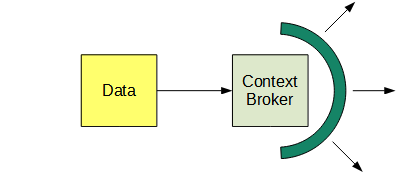
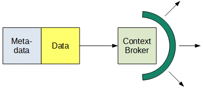
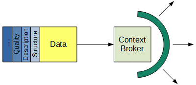
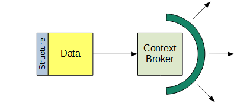
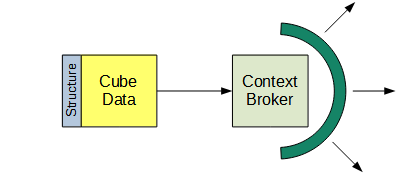

# Problem statement

We want to publish statistical data with the Context Broker:

But data means nothing without metadata, so we want also to publish metadata:

Metadata comes in many flavors and many standards:

For the sake of simplicity, we can start with structural metadata:

We can also start with one specific kind of data, dimensional or cube data:

